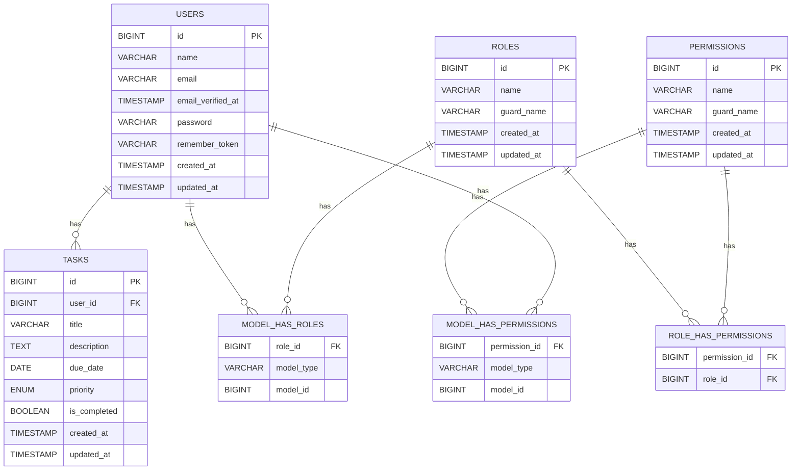

# Tutorial Membuat Aplikasi Web TodoList untuk Pemula

Oleh: Manus AI

## 1. Konsep Bisnis Aplikasi TodoList

Aplikasi TodoList adalah alat manajemen tugas yang membantu pengguna mengatur, melacak, dan menyelesaikan tugas-tugas mereka. Konsep bisnis di balik aplikasi ini sederhana namun sangat efektif: menyediakan platform yang intuitif dan efisien untuk meningkatkan produktivitas pribadi maupun tim. Aplikasi ini dirancang untuk mempermudah pengguna dalam mengelola daftar tugas harian, mingguan, atau proyek jangka panjang, memastikan tidak ada tugas yang terlewat dan semua pekerjaan dapat diselesaikan tepat waktu.

### 1.1. Tujuan Aplikasi

Tujuan utama dari aplikasi TodoList ini adalah:

-   **Meningkatkan Produktivitas:** Membantu pengguna fokus pada tugas-tugas penting dan menghindari penundaan.
-   **Organisasi Tugas:** Menyediakan cara yang terstruktur untuk mengelompokkan dan memprioritaskan tugas.
-   **Pengingat dan Notifikasi:** Memastikan pengguna tidak melewatkan tenggat waktu penting.
-   **Kolaborasi (Opsional):** Memungkinkan berbagi daftar tugas dengan orang lain untuk proyek tim.
-   **Aksesibilitas:** Dapat diakses dari berbagai perangkat (desktop dan mobile) dengan antarmuka yang responsif.

### 1.2. Fitur Utama yang Direncanakan

Berikut adalah daftar fitur utama yang akan diimplementasikan dalam tutorial ini:

1.  **Manajemen Pengguna:**

    -   Registrasi dan Login Pengguna.
    -   Manajemen Profil Pengguna.
    -   Sistem Role dan Permission (Admin, Pengguna Biasa) menggunakan Spatie Role Permission.

2.  **Manajemen Tugas (TodoList):**

    -   Menambah tugas baru (judul, deskripsi, tenggat waktu, prioritas).
    -   Melihat daftar tugas (semua, selesai, belum selesai, berdasarkan prioritas).
    -   Mengedit detail tugas.
    -   Menandai tugas sebagai selesai.
    -   Menghapus tugas.
    -   Filter dan pencarian tugas.

3.  **Antarmuka Pengguna (UI):**

    -   Desain yang bersih, minimalis, dan profesional menggunakan Tailwind CSS.
    -   Responsif untuk perangkat mobile dan desktop.
    -   Halaman Landing Page/Welcome.
    -   Halaman Login dan Register.

4.  **Teknologi yang Digunakan:**
    -   **Backend Framework:** Laravel (versi terbaru).
    -   **Frontend Interactivity:** Livewire (versi terbaru).
    -   **Database:** MySQL.
    -   **UI Framework:** Tailwind CSS.
    -   **Manajemen Role/Permission:** Spatie Laravel Permission.

### 1.3. Target Pengguna

Aplikasi ini ditargetkan untuk:

-   **Individu:** Mahasiswa, pekerja lepas, profesional yang ingin mengelola tugas pribadi.
-   **Tim Kecil:** Kelompok kerja yang membutuhkan alat sederhana untuk kolaborasi tugas.
-   **Siapa Saja:** Yang mencari solusi sederhana dan efektif untuk manajemen tugas.

### 1.4. Studi Kasus Sederhana

Sebagai contoh, bayangkan seorang mahasiswa yang memiliki beberapa tugas kuliah, seperti:

-   Mengerjakan laporan akhir mata kuliah Basis Data (Prioritas Tinggi, Tenggat Waktu: 25 Agustus 2025).
-   Membaca bab 3 buku Algoritma (Prioritas Sedang, Tenggat Waktu: 20 Agustus 2025).
-   Mempersiapkan presentasi kelompok (Prioritas Tinggi, Tenggat Waktu: 28 Agustus 2025).

Dengan aplikasi TodoList ini, mahasiswa tersebut dapat dengan mudah menambahkan tugas-tugas ini, menetapkan prioritas dan tenggat waktu, serta menandai tugas yang sudah selesai. Ini akan membantu mereka tetap terorganisir dan tidak melewatkan tenggat waktu penting.

### 1.5. Persiapan Lingkungan Pengembangan

Sebelum memulai, pastikan Anda memiliki lingkungan pengembangan yang siap. Anda akan membutuhkan:

-   **PHP:** Versi 8.1 atau lebih tinggi.
-   **Composer:** Manajer dependensi PHP.
-   **Node.js & npm/Yarn:** Untuk mengelola dependensi frontend (Tailwind CSS).
-   **MySQL Server:** Untuk database.
-   **Web Server:** Apache atau Nginx (biasanya sudah termasuk dalam XAMPP/Laragon/Valet).
-   **Git:** Untuk kontrol versi (opsional, namun sangat direkomendasikan).
-   **Code Editor:** Visual Studio Code (direkomendasikan).

Pastikan semua komponen ini terinstal dan berfungsi dengan baik di sistem Anda. Anda dapat memverifikasi instalasi dengan menjalankan perintah berikut di terminal:

```bash
php -v
composer -v
node -v
npm -v
mysql --version
```

Jika ada yang belum terinstal, silakan instal terlebih dahulu sesuai dengan sistem operasi Anda. Untuk tutorial ini, kami akan mengasumsikan Anda sudah memiliki lingkungan pengembangan dasar yang berfungsi.

## 2. Rancangan Database MySQL

Perancangan database adalah langkah krusial dalam pengembangan aplikasi. Database yang terstruktur dengan baik akan memastikan integritas data, efisiensi query, dan skalabilitas aplikasi di masa depan. Untuk aplikasi TodoList ini, kita akan menggunakan MySQL sebagai sistem manajemen database relasional (RDBMS). Berikut adalah rancangan tabel yang akan kita gunakan:

### 2.1. Tabel `users`

Tabel `users` akan menyimpan informasi dasar pengguna aplikasi. Laravel secara default menyediakan migrasi untuk tabel ini, namun kita akan menyesuaikannya sedikit untuk kebutuhan kita.

| Kolom               | Tipe Data             | Keterangan                                |
| :------------------ | :-------------------- | :---------------------------------------- |
| `id`                | `BIGINT(20) UNSIGNED` | Primary Key, Auto Increment               |
| `name`              | `VARCHAR(255)`        | Nama lengkap pengguna                     |
| `email`             | `VARCHAR(255)`        | Alamat email unik pengguna, untuk login   |
| `email_verified_at` | `TIMESTAMP`           | Waktu verifikasi email (nullable)         |
| `password`          | `VARCHAR(255)`        | Hash kata sandi pengguna                  |
| `remember_token`    | `VARCHAR(100)`        | Token untuk fitur 'ingat saya' (nullable) |
| `created_at`        | `TIMESTAMP`           | Waktu pembuatan record                    |
| `updated_at`        | `TIMESTAMP`           | Waktu terakhir record diperbarui          |

### 2.2. Tabel `roles` (Spatie Laravel Permission)

Tabel `roles` akan menyimpan daftar peran yang tersedia dalam aplikasi (misalnya, 'admin', 'user'). Tabel ini akan dibuat oleh paket Spatie Laravel Permission.

| Kolom        | Tipe Data             | Keterangan                              |
| :----------- | :-------------------- | :-------------------------------------- |
| `id`         | `BIGINT(20) UNSIGNED` | Primary Key, Auto Increment             |
| `name`       | `VARCHAR(255)`        | Nama peran (unik)                       |
| `guard_name` | `VARCHAR(255)`        | Nama guard (misalnya, 'web' atau 'api') |
| `created_at` | `TIMESTAMP`           | Waktu pembuatan record                  |
| `updated_at` | `TIMESTAMP`           | Waktu terakhir record diperbarui        |

### 2.3. Tabel `permissions` (Spatie Laravel Permission)

Tabel `permissions` akan menyimpan daftar izin atau hak akses yang dapat diberikan kepada peran atau pengguna (misalnya, 'create task', 'edit user'). Tabel ini juga akan dibuat oleh paket Spatie Laravel Permission.

| Kolom        | Tipe Data             | Keterangan                       |
| :----------- | :-------------------- | :------------------------------- |
| `id`         | `BIGINT(20) UNSIGNED` | Primary Key, Auto Increment      |
| `name`       | `VARCHAR(255)`        | Nama izin (unik)                 |
| `guard_name` | `VARCHAR(255)`        | Nama guard                       |
| `created_at` | `TIMESTAMP`           | Waktu pembuatan record           |
| `updated_at` | `TIMESTAMP`           | Waktu terakhir record diperbarui |

### 2.4. Tabel `model_has_roles` (Spatie Laravel Permission)

Tabel pivot ini menghubungkan model (misalnya, `User`) dengan peran. Ini memungkinkan satu pengguna memiliki banyak peran.

| Kolom        | Tipe Data             | Keterangan                                 |
| :----------- | :-------------------- | :----------------------------------------- |
| `role_id`    | `BIGINT(20) UNSIGNED` | Foreign Key ke tabel `roles`               |
| `model_type` | `VARCHAR(255)`        | Tipe model (misalnya, `App\\Models\\User`) |
| `model_id`   | `BIGINT(20) UNSIGNED` | ID model (misalnya, ID pengguna)           |

### 2.5. Tabel `model_has_permissions` (Spatie Laravel Permission)

Tabel pivot ini menghubungkan model (misalnya, `User`) dengan izin secara langsung. Ini memungkinkan izin langsung diberikan kepada pengguna, melewati peran.

| Kolom           | Tipe Data             | Keterangan                         |
| :-------------- | :-------------------- | :--------------------------------- |
| `permission_id` | `BIGINT(20) UNSIGNED` | Foreign Key ke tabel `permissions` |
| `model_type`    | `VARCHAR(255)`        | Tipe model                         |
| `model_id`      | `BIGINT(20) UNSIGNED` | ID model                           |

### 2.6. Tabel `role_has_permissions` (Spatie Laravel Permission)

Tabel pivot ini menghubungkan peran dengan izin. Ini adalah cara utama untuk memberikan izin kepada peran, dan semua pengguna dengan peran tersebut akan mewarisi izin-izin ini.

| Kolom           | Tipe Data             | Keterangan                         |
| :-------------- | :-------------------- | :--------------------------------- |
| `permission_id` | `BIGINT(20) UNSIGNED` | Foreign Key ke tabel `permissions` |
| `role_id`       | `BIGINT(20) UNSIGNED` | Foreign Key ke tabel `roles`       |

### 2.7. Tabel `tasks`

Tabel `tasks` akan menyimpan semua tugas yang dibuat oleh pengguna.

| Kolom          | Tipe Data                       | Keterangan                                   |
| :------------- | :------------------------------ | :------------------------------------------- |
| `id`           | `BIGINT(20) UNSIGNED`           | Primary Key, Auto Increment                  |
| `user_id`      | `BIGINT(20) UNSIGNED`           | Foreign Key ke tabel `users` (pemilik tugas) |
| `title`        | `VARCHAR(255)`                  | Judul tugas                                  |
| `description`  | `TEXT`                          | Deskripsi detail tugas (nullable)            |
| `due_date`     | `DATE`                          | Tanggal tenggat waktu (nullable)             |
| `priority`     | `ENUM('low', 'medium', 'high')` | Prioritas tugas                              |
| `is_completed` | `BOOLEAN`                       | Status tugas (0=belum selesai, 1=selesai)    |
| `created_at`   | `TIMESTAMP`                     | Waktu pembuatan record                       |
| `updated_at`   | `TIMESTAMP`                     | Waktu terakhir record diperbarui             |

### 2.8. Diagram Hubungan Entitas (ERD) Sederhana

Berikut adalah representasi sederhana dari hubungan antar tabel:



Dengan rancangan database ini, kita memiliki struktur yang kokoh untuk menyimpan data pengguna, peran, izin, dan tugas. Langkah selanjutnya adalah mengimplementasikan ini di Laravel menggunakan migrasi.

## 3. Setup Framework Laravel dengan Livewire

Setelah merancang database, langkah selanjutnya adalah menyiapkan proyek Laravel dan mengintegrasikan Livewire. Laravel adalah framework PHP yang elegan dan ekspresif, sementara Livewire memungkinkan kita membangun antarmuka dinamis dengan mudah menggunakan PHP, tanpa perlu menulis banyak JavaScript.

### 3.1. Membuat Proyek Laravel Baru

Buka terminal Anda dan jalankan perintah berikut untuk membuat proyek Laravel baru. Pastikan Anda berada di direktori tempat Anda biasa menyimpan proyek-proyek Anda.

```bash
composer create-project laravel/laravel todolist-app
```

Perintah ini akan membuat direktori baru bernama `todolist-app` dan mengunduh semua file serta dependensi yang diperlukan oleh Laravel. Setelah selesai, masuk ke direktori proyek:

```bash
cd todolist-app
```

### 3.2. Konfigurasi Database

Selanjutnya, kita perlu mengkonfigurasi koneksi database. Buka file `.env` di root proyek Anda. File ini berisi variabel lingkungan untuk aplikasi Anda. Cari baris berikut dan sesuaikan dengan konfigurasi database MySQL Anda:

```env
DB_CONNECTION=mysql
DB_HOST=127.0.0.1
DB_PORT=3306
DB_DATABASE=todolist_db
DB_USERNAME=root
DB_PASSWORD=
```

-   `DB_DATABASE`: Nama database yang akan kita gunakan. Pastikan Anda sudah membuat database dengan nama ini di MySQL Anda (misalnya, menggunakan phpMyAdmin atau command line `CREATE DATABASE todolist_db;`).
-   `DB_USERNAME`: Nama pengguna database Anda (biasanya `root` untuk pengembangan lokal).
-   `DB_PASSWORD`: Kata sandi database Anda (kosongkan jika tidak ada).

Setelah menyimpan perubahan pada file `.env`, ada baiknya untuk membersihkan cache konfigurasi agar Laravel memuat pengaturan baru:

```bash
php artisan config:cache
```

### 3.3. Membuat Migrasi Database

Sekarang kita akan membuat file migrasi untuk tabel `tasks` yang telah kita rancang sebelumnya. Laravel sudah menyediakan migrasi untuk tabel `users`.

Jalankan perintah berikut untuk membuat file migrasi baru:

```bash
php artisan make:migration create_tasks_table
```

Perintah ini akan membuat file baru di direktori `database/migrations`. Buka file tersebut (misalnya, `YYYY_MM_DD_HHMMSS_create_tasks_table.php`) dan modifikasi method `up()` menjadi seperti ini:

```php
use Illuminate\Database\Migrations\Migration;
use Illuminate\Database\Schema\Blueprint;
use Illuminate\Support\Facades\Schema;

return new class extends Migration
{
    /**
     * Run the migrations.
     */
    public function up(): void
    {
        Schema::create('tasks', function (Blueprint $table) {
            $table->id();
            $table->foreignId('user_id')->constrained()->onDelete('cascade');
            $table->string('title');
            $table->text('description')->nullable();
            $table->date('due_date')->nullable();
            $table->enum('priority', ['low', 'medium', 'high'])->default('medium');
            $table->boolean('is_completed')->default(false);
            $table->timestamps();
        });
    }

    /**
     * Reverse the migrations.
     */
    public function down(): void
    {
        Schema::dropIfExists('tasks');
    }
};
```

Perhatikan bagaimana kita mendefinisikan setiap kolom sesuai dengan rancangan kita, termasuk `foreignId` untuk `user_id` yang secara otomatis membuat foreign key constraint ke tabel `users`.

### 3.4. Menjalankan Migrasi

Setelah semua file migrasi siap (termasuk yang dari Laravel dan yang akan kita tambahkan dari Spatie nanti), jalankan perintah berikut untuk membuat semua tabel di database Anda:

```bash
php artisan migrate
```

Perintah ini akan mengeksekusi semua migrasi yang belum dijalankan. Jika berhasil, Anda akan melihat tabel `users`, `password_reset_tokens`, `failed_jobs`, `personal_access_tokens`, dan `tasks` di database `todolist_db` Anda.

### 3.5. Instalasi dan Konfigurasi Livewire

Sekarang saatnya menginstal Livewire. Jalankan perintah Composer berikut:

```bash
composer require livewire/livewire
```

Setelah instalasi selesai, kita perlu menyertakan aset JavaScript dan CSS Livewire di layout utama aplikasi kita. Buka file `resources/views/welcome.blade.php` (atau layout utama yang akan Anda gunakan nanti, misalnya `app.blade.php`). Tambahkan `@livewireStyles` di dalam tag `<head>` dan `@livewireScripts` sebelum tag penutup `</body>`.

Karena kita akan membuat layout sendiri nanti, untuk sementara kita bisa membuat file layout sederhana. Buat file baru di `resources/views/layouts/app.blade.php`:

```html
<!DOCTYPE html>
<html lang="{{ str_replace('_', '-', app()->getLocale()) }}">
    <head>
        <meta charset="utf-8" />
        <meta name="viewport" content="width=device-width, initial-scale=1" />
        <title>TodoList App</title>
        @livewireStyles
    </head>
    <body>
        {{ $slot }} @livewireScripts
    </body>
</html>
```

Livewire v3 secara otomatis akan mendaftarkan dirinya, jadi tidak ada lagi langkah publikasi konfigurasi yang wajib seperti pada versi sebelumnya. Setup dasar Laravel dan Livewire kita sudah selesai. Langkah selanjutnya adalah menginstal dan mengkonfigurasi Spatie Role Permission.

## 4. Implementasi Spatie Role Permission untuk Manajemen Role

Manajemen peran dan izin adalah fitur penting untuk aplikasi yang membutuhkan kontrol akses yang berbeda untuk berbagai jenis pengguna. Kita akan menggunakan paket populer dari Spatie, yaitu `laravel-permission`, untuk mengelola peran dan izin di aplikasi TodoList kita.

### 4.1. Instalasi Spatie Laravel Permission

Instal paket `spatie/laravel-permission` melalui Composer:

```bash
composer require spatie/laravel-permission
```

### 4.2. Publikasi Migrasi dan Konfigurasi

Setelah instalasi selesai, publikasikan migrasi dan file konfigurasi paket. Migrasi ini akan membuat tabel `roles`, `permissions`, `model_has_roles`, `model_has_permissions`, dan `role_has_permissions` yang telah kita bahas di bagian rancangan database.

```bash
php artisan vendor:publish --provider="Spatie\\Permission\\PermissionServiceProvider" --tag="permission-migrations"
php artisan vendor:publish --provider="Spatie\\Permission\\PermissionServiceProvider" --tag="permission-config"
```

### 4.3. Menjalankan Migrasi

Sekarang, jalankan migrasi untuk membuat tabel-tabel yang diperlukan oleh Spatie Laravel Permission:

```bash
php artisan migrate
```

Anda akan melihat bahwa tabel-tabel seperti `roles`, `permissions`, dan tabel pivot lainnya telah dibuat di database Anda.

### 4.4. Konfigurasi Model User

Untuk mengaktifkan fungsionalitas peran dan izin pada model `User` Anda, buka file `app/Models/User.php` dan tambahkan trait `HasRoles`:

```php
<?php

namespace App\Models;

// use Illuminate\Contracts\Auth\MustVerifyEmail;
use Illuminate\Database\Eloquent\Factories\HasFactory;
use Illuminate\Foundation\Auth\User as Authenticatable;
use Illuminate\Notifications\Notifiable;
use Laravel\Sanctum\HasApiTokens;
use Spatie\Permission\Traits\HasRoles; // Tambahkan baris ini

class User extends Authenticatable
{
    use HasApiTokens, HasFactory, Notifiable, HasRoles; // Tambahkan HasRoles di sini

    /**
     * The attributes that are mass assignable.
     *
     * @var array<int, string>
     */
    protected $fillable = [
        'name',
        'email',
        'password',
    ];

    /**
     * The attributes that should be hidden for serialization.
     *
     * @var array<int, string>
     */
    protected $hidden = [
        'password',
        'remember_token',
    ];

    /**
     * The attributes that should be cast.
     *
     * @var array<string, string>
     */
    protected $casts = [
        'email_verified_at' => 'datetime',
        'password' => 'hashed',
    ];
}
```

### 4.5. Membuat Seeder untuk Peran dan Izin Awal

Sangat disarankan untuk membuat seeder agar Anda memiliki peran dan izin dasar yang dapat digunakan saat aplikasi pertama kali di-deploy atau di-reset. Buat seeder baru:

```bash
php artisan make:seeder RolePermissionSeeder
```

Buka file `database/seeders/RolePermissionSeeder.php` dan tambahkan kode berikut:

```php
<?php

namespace Database\Seeders;

use Illuminate\Database\Console\Seeds\WithoutModelEvents;
use Illuminate\Database\Seeder;
use Spatie\Permission\Models\Role;
use Spatie\Permission\Models\Permission;

class RolePermissionSeeder extends Seeder
{
    /**
     * Run the database seeds.
     */
    public function run(): void
    {
        // Reset cached roles and permissions
        app()[\\Spatie\\Permission\\PermissionRegistrar::class]->forgetCachedPermissions();

        // Create permissions
        Permission::create(['name' => 'manage users']);
        Permission::create(['name' => 'manage roles']);
        Permission::create(['name' => 'manage tasks']);

        // Create roles and assign existing permissions
        $adminRole = Role::create(['name' => 'admin']);
        $adminRole->givePermissionTo(['manage users', 'manage roles', 'manage tasks']);

        $userRole = Role::create(['name' => 'user']);
        $userRole->givePermissionTo(['manage tasks']);

        // Assign a role to a user (example: assign 'admin' role to the first user)
        // Make sure you have at least one user in your database or create one here
        // \App\Models\User::factory()->create([
        //     'name' => 'Admin User',
        //     'email' => 'admin@example.com',
        //     'password' => bcrypt('password'),
        // ])->assignRole('admin');

        // \App\Models\User::factory()->create([
        //     'name' => 'Regular User',
        //     'email' => 'user@example.com',
        //     'password' => bcrypt('password'),
        // ])->assignRole('user');
    }
}
```

Kemudian, panggil seeder ini dari `database/seeders/DatabaseSeeder.php`:

```php
<?php

namespace Database\Seeders;

// use Illuminate\Database\Console\Seeds\WithoutModelEvents;
use Illuminate\Database\Seeder;

class DatabaseSeeder extends Seeder
{
    /**
     * Seed the application's database.
     */
    public function run(): void
    {
        // \App\Models\User::factory(10)->create();

        // \App\Models\User::factory()->create([
        //     'name' => 'Test User',
        //     'email' => 'test@example.com',
        // ]);

        $this->call(RolePermissionSeeder::class);
    }
}
```

Terakhir, jalankan seeder:

```bash
php artisan db:seed
```

Sekarang, Anda memiliki peran (`admin`, `user`) dan izin (`manage users`, `manage roles`, `manage tasks`) yang telah terdaftar di database Anda. Anda dapat mulai memberikan peran kepada pengguna dan memeriksa izin mereka. Misalnya, untuk memeriksa apakah pengguna memiliki peran atau izin:

```php
$user = App\Models\User::find(1);
$user->hasRole('admin'); // true atau false
$user->can('manage users'); // true atau false
```

Dengan ini, setup dasar untuk manajemen peran dan izin menggunakan Spatie Laravel Permission telah selesai. Selanjutnya, kita akan mengintegrasikan Tailwind CSS untuk antarmuka pengguna.

## 5. Setup Tailwind CSS dengan Desain Clean dan Mobile-Friendly

Tailwind CSS adalah framework CSS utility-first yang memungkinkan kita membangun antarmuka pengguna yang modern dan responsif dengan cepat. Dalam bagian ini, kita akan mengintegrasikan Tailwind CSS ke dalam proyek Laravel kita dan membuat desain yang bersih, minimalis, dan profesional.

### 5.1. Instalasi Tailwind CSS

Laravel sudah menyediakan dukungan untuk Tailwind CSS melalui Laravel Mix atau Vite. Untuk proyek Laravel terbaru, kita akan menggunakan Vite. Pertama, instal Tailwind CSS dan dependensinya:

```bash
npm install -D tailwindcss postcss autoprefixer
```

Kemudian, buat file konfigurasi Tailwind CSS:

```bash
npx tailwindcss init -p
```

Perintah ini akan membuat file `tailwind.config.js` dan `postcss.config.js` di root proyek Anda.

### 5.2. Konfigurasi Tailwind CSS

Buka file `tailwind.config.js` dan konfigurasikan path ke semua file template Anda:

```javascript
/** @type {import('tailwindcss').Config} */
export default {
    content: [
        "./resources/**/*.blade.php",
        "./resources/**/*.js",
        "./resources/**/*.vue",
    ],
    theme: {
        extend: {
            colors: {
                primary: {
                    50: "#eff6ff",
                    100: "#dbeafe",
                    200: "#bfdbfe",
                    300: "#93c5fd",
                    400: "#60a5fa",
                    500: "#3b82f6",
                    600: "#2563eb",
                    700: "#1d4ed8",
                    800: "#1e40af",
                    900: "#1e3a8a",
                },
                gray: {
                    50: "#f9fafb",
                    100: "#f3f4f6",
                    200: "#e5e7eb",
                    300: "#d1d5db",
                    400: "#9ca3af",
                    500: "#6b7280",
                    600: "#4b5563",
                    700: "#374151",
                    800: "#1f2937",
                    900: "#111827",
                },
            },
            fontFamily: {
                sans: ["Inter", "ui-sans-serif", "system-ui"],
            },
        },
    },
    plugins: [require("@tailwindcss/forms")],
};
```

Perhatikan bahwa kita menambahkan plugin `@tailwindcss/forms` untuk styling form yang lebih baik. Instal plugin ini:

```bash
npm install -D @tailwindcss/forms
```

### 5.3. Konfigurasi CSS

Buka file `resources/css/app.css` dan ganti isinya dengan:

```css
@tailwind base;
@tailwind components;
@tailwind utilities;

/* Custom styles */
@layer base {
    html {
        font-family: "Inter", ui-sans-serif, system-ui;
    }
}

@layer components {
    .btn {
        @apply inline-flex items-center px-4 py-2 border border-transparent text-sm font-medium rounded-md shadow-sm focus:outline-none focus:ring-2 focus:ring-offset-2 transition-colors duration-200;
    }

    .btn-primary {
        @apply btn bg-primary-600 text-white hover:bg-primary-700 focus:ring-primary-500;
    }

    .btn-secondary {
        @apply btn bg-gray-200 text-gray-900 hover:bg-gray-300 focus:ring-gray-500;
    }

    .btn-danger {
        @apply btn bg-red-600 text-white hover:bg-red-700 focus:ring-red-500;
    }

    .form-input {
        @apply block w-full rounded-md border-gray-300 shadow-sm focus:border-primary-500 focus:ring-primary-500 sm:text-sm;
    }

    .form-label {
        @apply block text-sm font-medium text-gray-700 mb-1;
    }

    .card {
        @apply bg-white overflow-hidden shadow rounded-lg;
    }

    .card-header {
        @apply px-4 py-5 sm:px-6 border-b border-gray-200;
    }

    .card-body {
        @apply px-4 py-5 sm:p-6;
    }
}
```

### 5.4. Konfigurasi Vite

Pastikan file `vite.config.js` Anda sudah dikonfigurasi dengan benar untuk memproses CSS:

```javascript
import { defineConfig } from "vite";
import laravel from "laravel-vite-plugin";

export default defineConfig({
    plugins: [
        laravel({
            input: ["resources/css/app.css", "resources/js/app.js"],
            refresh: true,
        }),
    ],
});
```

### 5.5. Memperbarui Layout Utama

Sekarang, mari kita perbarui layout utama kita untuk menggunakan Tailwind CSS. Buka file `resources/views/layouts/app.blade.php` dan perbarui dengan kode berikut:

```html
<!DOCTYPE html>
<html lang="{{ str_replace('_', '-', app()->getLocale()) }}">
    <head>
        <meta charset="utf-8" />
        <meta name="viewport" content="width=device-width, initial-scale=1" />
        <meta name="csrf-token" content="{{ csrf_token() }}" />

        <title>{{ config('app.name', 'TodoList App') }}</title>

        <!-- Fonts -->
        <link rel="preconnect" href="https://fonts.bunny.net" />
        <link
            href="https://fonts.bunny.net/css?family=inter:400,500,600&display=swap"
            rel="stylesheet"
        />

        <!-- Scripts -->
        @vite(['resources/css/app.css', 'resources/js/app.js']) @livewireStyles
    </head>
    <body class="font-sans antialiased bg-gray-50">
        <div class="min-h-screen">
            <!-- Navigation -->
            @auth
            <nav class="bg-white shadow">
                <div class="max-w-7xl mx-auto px-4 sm:px-6 lg:px-8">
                    <div class="flex justify-between h-16">
                        <div class="flex">
                            <div class="flex-shrink-0 flex items-center">
                                <h1 class="text-xl font-bold text-gray-900">
                                    TodoList
                                </h1>
                            </div>
                            <div
                                class="hidden space-x-8 sm:-my-px sm:ml-10 sm:flex"
                            >
                                <a
                                    href="{{ route('dashboard') }}"
                                    class="border-transparent text-gray-500 hover:text-gray-700 hover:border-gray-300 whitespace-nowrap py-2 px-1 border-b-2 font-medium text-sm"
                                >
                                    Dashboard
                                </a>
                                <a
                                    href="{{ route('tasks.index') }}"
                                    class="border-transparent text-gray-500 hover:text-gray-700 hover:border-gray-300 whitespace-nowrap py-2 px-1 border-b-2 font-medium text-sm"
                                >
                                    Tasks
                                </a>
                                @can('manage users')
                                <a
                                    href="{{ route('users.index') }}"
                                    class="border-transparent text-gray-500 hover:text-gray-700 hover:border-gray-300 whitespace-nowrap py-2 px-1 border-b-2 font-medium text-sm"
                                >
                                    Users
                                </a>
                                @endcan @can('manage roles')
                                <a
                                    href="{{ route('roles.index') }}"
                                    class="border-transparent text-gray-500 hover:text-gray-700 hover:border-gray-300 whitespace-nowrap py-2 px-1 border-b-2 font-medium text-sm"
                                >
                                    Roles
                                </a>
                                @endcan
                            </div>
                        </div>
                        <div class="hidden sm:flex sm:items-center sm:ml-6">
                            <div class="ml-3 relative">
                                <div class="flex items-center space-x-4">
                                    <span class="text-sm text-gray-700"
                                        >{{ Auth::user()->name }}</span
                                    >
                                    <form
                                        method="POST"
                                        action="{{ route('logout') }}"
                                    >
                                        @csrf
                                        <button
                                            type="submit"
                                            class="text-sm text-gray-500 hover:text-gray-700"
                                        >
                                            Logout
                                        </button>
                                    </form>
                                </div>
                            </div>
                        </div>
                    </div>
                </div>
            </nav>
            @endauth

            <!-- Page Content -->
            <main>{{ $slot }}</main>
        </div>

        @livewireScripts
    </body>
</html>
```

### 5.6. Membuat Komponen Layout Tambahan

Untuk mempermudah pengembangan, mari kita buat beberapa komponen layout tambahan. Buat file `resources/views/components/page-header.blade.php`:

```html
@props(['title', 'description' => null])

<div class="bg-white shadow">
    <div class="max-w-7xl mx-auto py-6 px-4 sm:px-6 lg:px-8">
        <div class="md:flex md:items-center md:justify-between">
            <div class="flex-1 min-w-0">
                <h2
                    class="text-2xl font-bold leading-7 text-gray-900 sm:text-3xl sm:truncate"
                >
                    {{ $title }}
                </h2>
                @if($description)
                <p class="mt-1 text-sm text-gray-500">{{ $description }}</p>
                @endif
            </div>
            <div class="mt-4 flex md:mt-0 md:ml-4">{{ $slot }}</div>
        </div>
    </div>
</div>
```

Buat juga file `resources/views/components/alert.blade.php` untuk menampilkan pesan:

```html
@props(['type' => 'info', 'message']) @php $classes = [ 'info' => 'bg-blue-50
border-blue-200 text-blue-800', 'success' => 'bg-green-50 border-green-200
text-green-800', 'warning' => 'bg-yellow-50 border-yellow-200 text-yellow-800',
'error' => 'bg-red-50 border-red-200 text-red-800', ]; @endphp

<div class="rounded-md border p-4 {{ $classes[$type] ?? $classes['info'] }}">
    <div class="flex">
        <div class="ml-3">
            <p class="text-sm font-medium">{{ $message }}</p>
        </div>
    </div>
</div>
```

### 5.7. Kompilasi Aset

Sekarang, kompilasi aset CSS dan JavaScript Anda:

```bash
npm run dev
```

Untuk production, gunakan:

```bash
npm run build
```

Dengan setup ini, Anda memiliki Tailwind CSS yang siap digunakan dengan desain yang bersih dan responsif. Komponen-komponen yang telah kita buat akan membantu menjaga konsistensi desain di seluruh aplikasi. Selanjutnya, kita akan membuat sistem autentikasi dengan CRUD untuk login dan register.

## 6. Tutorial CRUD Auth Login dan Register

Sistem autentikasi adalah fondasi dari aplikasi web yang aman. Laravel menyediakan sistem autentikasi yang robust, dan kita akan mengintegrasikannya dengan Livewire untuk menciptakan pengalaman pengguna yang interaktif dan responsif. Dalam bagian ini, kita akan membuat halaman login, register, dan dashboard dengan desain yang bersih menggunakan Tailwind CSS.

### 6.1. Instalasi Laravel Breeze (Opsional)

Laravel Breeze menyediakan implementasi sederhana dari fitur autentikasi Laravel. Namun, karena kita ingin menggunakan Livewire, kita akan membuat komponen autentikasi sendiri. Jika Anda ingin menggunakan Breeze sebagai starting point, Anda dapat menginstalnya:

```bash
composer require laravel/breeze --dev
php artisan breeze:install
```

Namun, untuk tutorial ini, kita akan membuat semuanya dari awal untuk pemahaman yang lebih mendalam.

### 6.2. Membuat Routes untuk Autentikasi

Buka file `routes/web.php` dan tambahkan routes untuk autentikasi:

```php
<?php

use Illuminate\Support\Facades\Route;
use App\Livewire\Auth\Login;
use App\Livewire\Auth\Register;
use App\Livewire\Dashboard;

/*
|--------------------------------------------------------------------------
| Web Routes
|--------------------------------------------------------------------------
*/

Route::get('/', function () {
    return view('welcome');
})->name('welcome');

// Authentication Routes
Route::middleware('guest')->group(function () {
    Route::get('/login', Login::class)->name('login');
    Route::get('/register', Register::class)->name('register');
});

// Protected Routes
Route::middleware('auth')->group(function () {
    Route::get('/dashboard', Dashboard::class)->name('dashboard');

    Route::post('/logout', function () {
        Auth::logout();
        request()->session()->invalidate();
        request()->session()->regenerateToken();
        return redirect('/');
    })->name('logout');
});
```

### 6.3. Membuat Komponen Livewire untuk Login

Buat komponen Livewire untuk halaman login:

```bash
php artisan make:livewire Auth/Login
```

Buka file `app/Livewire/Auth/Login.php` dan tambahkan kode berikut:

```php
<?php

namespace App\Livewire\Auth;

use Livewire\Component;
use Illuminate\Support\Facades\Auth;
use Illuminate\Validation\ValidationException;

class Login extends Component
{
    public $email = '';
    public $password = '';
    public $remember = false;

    protected $rules = [
        'email' => 'required|email',
        'password' => 'required|min:6',
    ];

    protected $messages = [
        'email.required' => 'Email wajib diisi.',
        'email.email' => 'Format email tidak valid.',
        'password.required' => 'Password wajib diisi.',
        'password.min' => 'Password minimal 6 karakter.',
    ];

    public function login()
    {
        $this->validate();

        if (Auth::attempt(['email' => $this->email, 'password' => $this->password], $this->remember)) {
            session()->regenerate();

            $this->redirect(route('dashboard'), navigate: true);
        } else {
            throw ValidationException::withMessages([
                'email' => 'Email atau password tidak valid.',
            ]);
        }
    }

    public function render()
    {
        return view('livewire.auth.login')->layout('layouts.guest');
    }
}
```

### 6.4. Membuat Layout untuk Guest

Buat layout khusus untuk halaman guest (login, register). Buat file `resources/views/layouts/guest.blade.php`:

```html
<!DOCTYPE html>
<html lang="{{ str_replace('_', '-', app()->getLocale()) }}">
    <head>
        <meta charset="utf-8" />
        <meta name="viewport" content="width=device-width, initial-scale=1" />
        <meta name="csrf-token" content="{{ csrf_token() }}" />

        <title>{{ config('app.name', 'TodoList App') }}</title>

        <!-- Fonts -->
        <link rel="preconnect" href="https://fonts.bunny.net" />
        <link
            href="https://fonts.bunny.net/css?family=inter:400,500,600&display=swap"
            rel="stylesheet"
        />

        <!-- Scripts -->
        @vite(['resources/css/app.css', 'resources/js/app.js']) @livewireStyles
    </head>
    <body class="font-sans text-gray-900 antialiased">
        <div
            class="min-h-screen flex flex-col sm:justify-center items-center pt-6 sm:pt-0 bg-gray-100"
        >
            <div
                class="w-full sm:max-w-md mt-6 px-6 py-4 bg-white shadow-md overflow-hidden sm:rounded-lg"
            >
                {{ $slot }}
            </div>
        </div>

        @livewireScripts
    </body>
</html>
```

### 6.5. Membuat View untuk Login

Buat file `resources/views/livewire/auth/login.blade.php`:

```html
<div>
    <div class="mb-4 text-center">
        <h2 class="text-2xl font-bold text-gray-900">Masuk ke Akun Anda</h2>
        <p class="mt-2 text-sm text-gray-600">
            Belum punya akun?
            <a
                href="{{ route('register') }}"
                class="font-medium text-primary-600 hover:text-primary-500"
                wire:navigate
            >
                Daftar di sini
            </a>
        </p>
    </div>

    <form wire:submit="login" class="space-y-6">
        <!-- Email Address -->
        <div>
            <label for="email" class="form-label">Email</label>
            <input
                id="email"
                type="email"
                wire:model="email"
                class="form-input @error('email') border-red-300 focus:border-red-500 focus:ring-red-500 @enderror"
                placeholder="Masukkan email Anda"
                required
                autofocus
            />
            @error('email')
            <p class="mt-1 text-sm text-red-600">{{ $message }}</p>
            @enderror
        </div>

        <!-- Password -->
        <div>
            <label for="password" class="form-label">Password</label>
            <input
                id="password"
                type="password"
                wire:model="password"
                class="form-input @error('password') border-red-300 focus:border-red-500 focus:ring-red-500 @enderror"
                placeholder="Masukkan password Anda"
                required
            />
            @error('password')
            <p class="mt-1 text-sm text-red-600">{{ $message }}</p>
            @enderror
        </div>

        <!-- Remember Me -->
        <div class="flex items-center">
            <input
                id="remember"
                type="checkbox"
                wire:model="remember"
                class="h-4 w-4 text-primary-600 focus:ring-primary-500 border-gray-300 rounded"
            />
            <label for="remember" class="ml-2 block text-sm text-gray-900">
                Ingat saya
            </label>
        </div>

        <!-- Submit Button -->
        <div>
            <button
                type="submit"
                class="btn-primary w-full justify-center"
                wire:loading.attr="disabled"
            >
                <span wire:loading.remove>Masuk</span>
                <span wire:loading>Memproses...</span>
            </button>
        </div>
    </form>
</div>
```

### 6.6. Membuat Komponen Livewire untuk Register

Buat komponen Livewire untuk halaman register:

```bash
php artisan make:livewire Auth/Register
```

Buka file `app/Livewire/Auth/Register.php`:

```php
<?php

namespace App\Livewire\Auth;

use App\Models\User;
use Livewire\Component;
use Illuminate\Support\Facades\Auth;
use Illuminate\Support\Facades\Hash;
use Illuminate\Validation\Rules\Password;

class Register extends Component
{
    public $name = '';
    public $email = '';
    public $password = '';
    public $password_confirmation = '';

    protected function rules()
    {
        return [
            'name' => 'required|string|max:255',
            'email' => 'required|string|email|max:255|unique:users',
            'password' => ['required', 'confirmed', Password::defaults()],
        ];
    }

    protected $messages = [
        'name.required' => 'Nama wajib diisi.',
        'name.max' => 'Nama maksimal 255 karakter.',
        'email.required' => 'Email wajib diisi.',
        'email.email' => 'Format email tidak valid.',
        'email.unique' => 'Email sudah terdaftar.',
        'password.required' => 'Password wajib diisi.',
        'password.confirmed' => 'Konfirmasi password tidak cocok.',
    ];

    public function register()
    {
        $this->validate();

        $user = User::create([
            'name' => $this->name,
            'email' => $this->email,
            'password' => Hash::make($this->password),
        ]);

        // Assign default role
        $user->assignRole('user');

        Auth::login($user);

        session()->regenerate();

        $this->redirect(route('dashboard'), navigate: true);
    }

    public function render()
    {
        return view('livewire.auth.register')->layout('layouts.guest');
    }
}
```

### 6.7. Membuat View untuk Register

Buat file `resources/views/livewire/auth/register.blade.php`:

```html
<div>
    <div class="mb-4 text-center">
        <h2 class="text-2xl font-bold text-gray-900">Buat Akun Baru</h2>
        <p class="mt-2 text-sm text-gray-600">
            Sudah punya akun?
            <a
                href="{{ route('login') }}"
                class="font-medium text-primary-600 hover:text-primary-500"
                wire:navigate
            >
                Masuk di sini
            </a>
        </p>
    </div>

    <form wire:submit="register" class="space-y-6">
        <!-- Name -->
        <div>
            <label for="name" class="form-label">Nama Lengkap</label>
            <input
                id="name"
                type="text"
                wire:model="name"
                class="form-input @error('name') border-red-300 focus:border-red-500 focus:ring-red-500 @enderror"
                placeholder="Masukkan nama lengkap Anda"
                required
                autofocus
            />
            @error('name')
            <p class="mt-1 text-sm text-red-600">{{ $message }}</p>
            @enderror
        </div>

        <!-- Email Address -->
        <div>
            <label for="email" class="form-label">Email</label>
            <input
                id="email"
                type="email"
                wire:model="email"
                class="form-input @error('email') border-red-300 focus:border-red-500 focus:ring-red-500 @enderror"
                placeholder="Masukkan email Anda"
                required
            />
            @error('email')
            <p class="mt-1 text-sm text-red-600">{{ $message }}</p>
            @enderror
        </div>

        <!-- Password -->
        <div>
            <label for="password" class="form-label">Password</label>
            <input
                id="password"
                type="password"
                wire:model="password"
                class="form-input @error('password') border-red-300 focus:border-red-500 focus:ring-red-500 @enderror"
                placeholder="Masukkan password Anda"
                required
            />
            @error('password')
            <p class="mt-1 text-sm text-red-600">{{ $message }}</p>
            @enderror
        </div>

        <!-- Confirm Password -->
        <div>
            <label for="password_confirmation" class="form-label"
                >Konfirmasi Password</label
            >
            <input
                id="password_confirmation"
                type="password"
                wire:model="password_confirmation"
                class="form-input"
                placeholder="Konfirmasi password Anda"
                required
            />
        </div>

        <!-- Submit Button -->
        <div>
            <button
                type="submit"
                class="btn-primary w-full justify-center"
                wire:loading.attr="disabled"
            >
                <span wire:loading.remove>Daftar</span>
                <span wire:loading>Memproses...</span>
            </button>
        </div>
    </form>
</div>
```

### 6.8. Membuat Komponen Dashboard

Buat komponen Livewire untuk dashboard:

```bash
php artisan make:livewire Dashboard
```

Buka file `app/Livewire/Dashboard.php`:

```php
<?php

namespace App\Livewire;

use Livewire\Component;
use App\Models\Task;
use Illuminate\Support\Facades\Auth;

class Dashboard extends Component
{
    public function render()
    {
        $user = Auth::user();
        $totalTasks = Task::where('user_id', $user->id)->count();
        $completedTasks = Task::where('user_id', $user->id)->where('is_completed', true)->count();
        $pendingTasks = $totalTasks - $completedTasks;
        $recentTasks = Task::where('user_id', $user->id)
                          ->orderBy('created_at', 'desc')
                          ->limit(5)
                          ->get();

        return view('livewire.dashboard', [
            'totalTasks' => $totalTasks,
            'completedTasks' => $completedTasks,
            'pendingTasks' => $pendingTasks,
            'recentTasks' => $recentTasks,
        ])->layout('layouts.app');
    }
}
```

### 6.9. Membuat View untuk Dashboard

Buat file `resources/views/livewire/dashboard.blade.php`:

```html
<div>
    <x-page-header
        title="Dashboard"
        description="Selamat datang di TodoList App"
    />

    <div class="max-w-7xl mx-auto py-6 sm:px-6 lg:px-8">
        <!-- Stats -->
        <div class="grid grid-cols-1 gap-5 sm:grid-cols-3 mb-8">
            <div class="card">
                <div class="card-body">
                    <div class="flex items-center">
                        <div class="flex-shrink-0">
                            <div
                                class="w-8 h-8 bg-blue-500 rounded-md flex items-center justify-center"
                            >
                                <svg
                                    class="w-5 h-5 text-white"
                                    fill="none"
                                    stroke="currentColor"
                                    viewBox="0 0 24 24"
                                >
                                    <path
                                        stroke-linecap="round"
                                        stroke-linejoin="round"
                                        stroke-width="2"
                                        d="M9 5H7a2 2 0 00-2 2v10a2 2 0 002 2h8a2 2 0 002-2V7a2 2 0 00-2-2h-2M9 5a2 2 0 002 2h2a2 2 0 002-2M9 5a2 2 0 012-2h2a2 2 0 012 2"
                                    ></path>
                                </svg>
                            </div>
                        </div>
                        <div class="ml-5 w-0 flex-1">
                            <dl>
                                <dt
                                    class="text-sm font-medium text-gray-500 truncate"
                                >
                                    Total Tugas
                                </dt>
                                <dd class="text-lg font-medium text-gray-900">
                                    {{ $totalTasks }}
                                </dd>
                            </dl>
                        </div>
                    </div>
                </div>
            </div>

            <div class="card">
                <div class="card-body">
                    <div class="flex items-center">
                        <div class="flex-shrink-0">
                            <div
                                class="w-8 h-8 bg-green-500 rounded-md flex items-center justify-center"
                            >
                                <svg
                                    class="w-5 h-5 text-white"
                                    fill="none"
                                    stroke="currentColor"
                                    viewBox="0 0 24 24"
                                >
                                    <path
                                        stroke-linecap="round"
                                        stroke-linejoin="round"
                                        stroke-width="2"
                                        d="M5 13l4 4L19 7"
                                    ></path>
                                </svg>
                            </div>
                        </div>
                        <div class="ml-5 w-0 flex-1">
                            <dl>
                                <dt
                                    class="text-sm font-medium text-gray-500 truncate"
                                >
                                    Selesai
                                </dt>
                                <dd class="text-lg font-medium text-gray-900">
                                    {{ $completedTasks }}
                                </dd>
                            </dl>
                        </div>
                    </div>
                </div>
            </div>

            <div class="card">
                <div class="card-body">
                    <div class="flex items-center">
                        <div class="flex-shrink-0">
                            <div
                                class="w-8 h-8 bg-yellow-500 rounded-md flex items-center justify-center"
                            >
                                <svg
                                    class="w-5 h-5 text-white"
                                    fill="none"
                                    stroke="currentColor"
                                    viewBox="0 0 24 24"
                                >
                                    <path
                                        stroke-linecap="round"
                                        stroke-linejoin="round"
                                        stroke-width="2"
                                        d="M12 8v4l3 3m6-3a9 9 0 11-18 0 9 9 0 0118 0z"
                                    ></path>
                                </svg>
                            </div>
                        </div>
                        <div class="ml-5 w-0 flex-1">
                            <dl>
                                <dt
                                    class="text-sm font-medium text-gray-500 truncate"
                                >
                                    Pending
                                </dt>
                                <dd class="text-lg font-medium text-gray-900">
                                    {{ $pendingTasks }}
                                </dd>
                            </dl>
                        </div>
                    </div>
                </div>
            </div>
        </div>

        <!-- Recent Tasks -->
        <div class="card">
            <div class="card-header">
                <h3 class="text-lg leading-6 font-medium text-gray-900">
                    Tugas Terbaru
                </h3>
            </div>
            <div class="card-body">
                @if($recentTasks->count() > 0)
                <div class="flow-root">
                    <ul role="list" class="-mb-8">
                        @foreach($recentTasks as $task)
                        <li>
                            <div class="relative pb-8">
                                @if(!$loop->last)
                                <span
                                    class="absolute top-4 left-4 -ml-px h-full w-0.5 bg-gray-200"
                                    aria-hidden="true"
                                ></span>
                                @endif
                                <div class="relative flex space-x-3">
                                    <div>
                                        <span
                                            class="h-8 w-8 rounded-full {{ $task->is_completed ? 'bg-green-500' : 'bg-gray-400' }} flex items-center justify-center ring-8 ring-white"
                                        >
                                            @if($task->is_completed)
                                            <svg
                                                class="w-5 h-5 text-white"
                                                fill="none"
                                                stroke="currentColor"
                                                viewBox="0 0 24 24"
                                            >
                                                <path
                                                    stroke-linecap="round"
                                                    stroke-linejoin="round"
                                                    stroke-width="2"
                                                    d="M5 13l4 4L19 7"
                                                ></path>
                                            </svg>
                                            @else
                                            <svg
                                                class="w-5 h-5 text-white"
                                                fill="none"
                                                stroke="currentColor"
                                                viewBox="0 0 24 24"
                                            >
                                                <path
                                                    stroke-linecap="round"
                                                    stroke-linejoin="round"
                                                    stroke-width="2"
                                                    d="M12 8v4l3 3m6-3a9 9 0 11-18 0 9 9 0 0118 0z"
                                                ></path>
                                            </svg>
                                            @endif
                                        </span>
                                    </div>
                                    <div
                                        class="min-w-0 flex-1 pt-1.5 flex justify-between space-x-4"
                                    >
                                        <div>
                                            <p class="text-sm text-gray-500">
                                                {{ $task->title }}
                                            </p>
                                            @if($task->due_date)
                                            <p class="text-xs text-gray-400">
                                                Tenggat: {{
                                                $task->due_date->format('d M Y')
                                                }}
                                            </p>
                                            @endif
                                        </div>
                                        <div
                                            class="text-right text-sm whitespace-nowrap text-gray-500"
                                        >
                                            <time
                                                datetime="{{ $task->created_at }}"
                                                >{{
                                                $task->created_at->diffForHumans()
                                                }}</time
                                            >
                                        </div>
                                    </div>
                                </div>
                            </div>
                        </li>
                        @endforeach
                    </ul>
                </div>
                @else
                <p class="text-gray-500 text-center py-4">
                    Belum ada tugas.
                    <a
                        href="{{ route('tasks.index') }}"
                        class="text-primary-600 hover:text-primary-500"
                        wire:navigate
                        >Buat tugas pertama Anda</a
                    >
                </p>
                @endif
            </div>
        </div>
    </div>
</div>
```

Dengan implementasi ini, Anda memiliki sistem autentikasi yang lengkap dengan halaman login, register, dan dashboard yang responsif dan interaktif menggunakan Livewire. Selanjutnya, kita akan membuat CRUD untuk aplikasi TodoList.

## 7. Tutorial CRUD Aplikasi TodoList dengan Livewire

Sekarang kita akan membuat inti dari aplikasi kita: sistem manajemen tugas (TodoList). Kita akan mengimplementasikan operasi CRUD (Create, Read, Update, Delete) lengkap menggunakan Livewire untuk memberikan pengalaman pengguna yang interaktif dan responsif.

### 7.1. Membuat Model Task

Pertama, kita perlu membuat model untuk tabel `tasks`. Jalankan perintah berikut:

```bash
php artisan make:model Task
```

Buka file `app/Models/Task.php` dan tambahkan kode berikut:

```php
<?php

namespace App\Models;

use Illuminate\Database\Eloquent\Factories\HasFactory;
use Illuminate\Database\Eloquent\Model;
use Illuminate\Database\Eloquent\Relations\BelongsTo;

class Task extends Model
{
    use HasFactory;

    protected $fillable = [
        'user_id',
        'title',
        'description',
        'due_date',
        'priority',
        'is_completed',
    ];

    protected $casts = [
        'due_date' => 'date',
        'is_completed' => 'boolean',
    ];

    /**
     * Get the user that owns the task.
     */
    public function user(): BelongsTo
    {
        return $this->belongsTo(User::class);
    }

    /**
     * Scope a query to only include tasks for a specific user.
     */
    public function scopeForUser($query, $userId)
    {
        return $query->where('user_id', $userId);
    }

    /**
     * Scope a query to only include completed tasks.
     */
    public function scopeCompleted($query)
    {
        return $query->where('is_completed', true);
    }

    /**
     * Scope a query to only include pending tasks.
     */
    public function scopePending($query)
    {
        return $query->where('is_completed', false);
    }

    /**
     * Get the priority badge color.
     */
    public function getPriorityColorAttribute()
    {
        return match($this->priority) {
            'high' => 'bg-red-100 text-red-800',
            'medium' => 'bg-yellow-100 text-yellow-800',
            'low' => 'bg-green-100 text-green-800',
            default => 'bg-gray-100 text-gray-800',
        };
    }

    /**
     * Get the priority label.
     */
    public function getPriorityLabelAttribute()
    {
        return match($this->priority) {
            'high' => 'Tinggi',
            'medium' => 'Sedang',
            'low' => 'Rendah',
            default => 'Tidak Diketahui',
        };
    }
}
```

### 7.2. Menambahkan Relasi di Model User

Buka file `app/Models/User.php` dan tambahkan relasi ke model Task:

```php
<?php

namespace App\Models;

// use Illuminate\Contracts\Auth\MustVerifyEmail;
use Illuminate\Database\Eloquent\Factories\HasFactory;
use Illuminate\Database\Eloquent\Relations\HasMany;
use Illuminate\Foundation\Auth\User as Authenticatable;
use Illuminate\Notifications\Notifiable;
use Laravel\Sanctum\HasApiTokens;
use Spatie\Permission\Traits\HasRoles;

class User extends Authenticatable
{
    use HasApiTokens, HasFactory, Notifiable, HasRoles;

    /**
     * The attributes that are mass assignable.
     *
     * @var array<int, string>
     */
    protected $fillable = [
        'name',
        'email',
        'password',
    ];

    /**
     * The attributes that should be hidden for serialization.
     *
     * @var array<int, string>
     */
    protected $hidden = [
        'password',
        'remember_token',
    ];

    /**
     * The attributes that should be cast.
     *
     * @var array<string, string>
     */
    protected $casts = [
        'email_verified_at' => 'datetime',
        'password' => 'hashed',
    ];

    /**
     * Get the tasks for the user.
     */
    public function tasks(): HasMany
    {
        return $this->hasMany(Task::class);
    }
}
```

### 7.3. Membuat Routes untuk Tasks

Tambahkan routes untuk tasks di file `routes/web.php`:

```php
<?php

use Illuminate\Support\Facades\Route;
use App\Livewire\Auth\Login;
use App\Livewire\Auth\Register;
use App\Livewire\Dashboard;
use App\Livewire\Tasks\TaskIndex;
use App\Livewire\Tasks\TaskCreate;
use App\Livewire\Tasks\TaskEdit;

/*
|--------------------------------------------------------------------------
| Web Routes
|--------------------------------------------------------------------------
*/

Route::get('/', function () {
    return view('welcome');
})->name('welcome');

// Authentication Routes
Route::middleware('guest')->group(function () {
    Route::get('/login', Login::class)->name('login');
    Route::get('/register', Register::class)->name('register');
});

// Protected Routes
Route::middleware('auth')->group(function () {
    Route::get('/dashboard', Dashboard::class)->name('dashboard');

    // Task Routes
    Route::get('/tasks', TaskIndex::class)->name('tasks.index');
    Route::get('/tasks/create', TaskCreate::class)->name('tasks.create');
    Route::get('/tasks/{task}/edit', TaskEdit::class)->name('tasks.edit');

    Route::post('/logout', function () {
        Auth::logout();
        request()->session()->invalidate();
        request()->session()->regenerateToken();
        return redirect('/');
    })->name('logout');
});
```

### 7.4. Membuat Komponen Livewire untuk Daftar Tasks

Buat komponen Livewire untuk menampilkan daftar tasks:

```bash
php artisan make:livewire Tasks/TaskIndex
```

Buka file `app/Livewire/Tasks/TaskIndex.php`:

```php
<?php

namespace App\Livewire\Tasks;

use App\Models\Task;
use Livewire\Component;
use Livewire\WithPagination;
use Illuminate\Support\Facades\Auth;

class TaskIndex extends Component
{
    use WithPagination;

    public $search = '';
    public $filterStatus = 'all';
    public $filterPriority = 'all';
    public $sortBy = 'created_at';
    public $sortDirection = 'desc';

    protected $queryString = [
        'search' => ['except' => ''],
        'filterStatus' => ['except' => 'all'],
        'filterPriority' => ['except' => 'all'],
        'sortBy' => ['except' => 'created_at'],
        'sortDirection' => ['except' => 'desc'],
    ];

    public function updatingSearch()
    {
        $this->resetPage();
    }

    public function updatingFilterStatus()
    {
        $this->resetPage();
    }

    public function updatingFilterPriority()
    {
        $this->resetPage();
    }

    public function sortBy($field)
    {
        if ($this->sortBy === $field) {
            $this->sortDirection = $this->sortDirection === 'asc' ? 'desc' : 'asc';
        } else {
            $this->sortBy = $field;
            $this->sortDirection = 'asc';
        }
    }

    public function toggleComplete($taskId)
    {
        $task = Task::where('id', $taskId)
                   ->where('user_id', Auth::id())
                   ->first();

        if ($task) {
            $task->update(['is_completed' => !$task->is_completed]);

            session()->flash('message', $task->is_completed ? 'Tugas berhasil diselesaikan!' : 'Tugas dikembalikan ke pending!');
        }
    }

    public function deleteTask($taskId)
    {
        $task = Task::where('id', $taskId)
                   ->where('user_id', Auth::id())
                   ->first();

        if ($task) {
            $task->delete();
            session()->flash('message', 'Tugas berhasil dihapus!');
        }
    }

    public function render()
    {
        $tasks = Task::where('user_id', Auth::id())
            ->when($this->search, function ($query) {
                $query->where(function ($q) {
                    $q->where('title', 'like', '%' . $this->search . '%')
                      ->orWhere('description', 'like', '%' . $this->search . '%');
                });
            })
            ->when($this->filterStatus !== 'all', function ($query) {
                if ($this->filterStatus === 'completed') {
                    $query->where('is_completed', true);
                } elseif ($this->filterStatus === 'pending') {
                    $query->where('is_completed', false);
                }
            })
            ->when($this->filterPriority !== 'all', function ($query) {
                $query->where('priority', $this->filterPriority);
            })
            ->orderBy($this->sortBy, $this->sortDirection)
            ->paginate(10);

        return view('livewire.tasks.task-index', [
            'tasks' => $tasks,
        ])->layout('layouts.app');
    }
}
```

### 7.5. Membuat View untuk Daftar Tasks

Buat file `resources/views/livewire/tasks/task-index.blade.php`:

```html
<div>
    <x-page-header title="Daftar Tugas" description="Kelola semua tugas Anda">
        <a href="{{ route('tasks.create') }}" class="btn-primary" wire:navigate>
            <svg
                class="w-4 h-4 mr-2"
                fill="none"
                stroke="currentColor"
                viewBox="0 0 24 24"
            >
                <path
                    stroke-linecap="round"
                    stroke-linejoin="round"
                    stroke-width="2"
                    d="M12 4v16m8-8H4"
                ></path>
            </svg>
            Tambah Tugas
        </a>
    </x-page-header>

    <div class="max-w-7xl mx-auto py-6 sm:px-6 lg:px-8">
        <!-- Flash Message -->
        @if (session()->has('message'))
        <div class="mb-4">
            <x-alert type="success" :message="session('message')" />
        </div>
        @endif

        <!-- Filters -->
        <div class="card mb-6">
            <div class="card-body">
                <div class="grid grid-cols-1 md:grid-cols-4 gap-4">
                    <!-- Search -->
                    <div>
                        <label for="search" class="form-label"
                            >Cari Tugas</label
                        >
                        <input
                            type="text"
                            wire:model.live.debounce.300ms="search"
                            placeholder="Cari berdasarkan judul atau deskripsi..."
                            class="form-input"
                        />
                    </div>

                    <!-- Status Filter -->
                    <div>
                        <label for="filterStatus" class="form-label"
                            >Status</label
                        >
                        <select
                            wire:model.live="filterStatus"
                            class="form-input"
                        >
                            <option value="all">Semua Status</option>
                            <option value="pending">Pending</option>
                            <option value="completed">Selesai</option>
                        </select>
                    </div>

                    <!-- Priority Filter -->
                    <div>
                        <label for="filterPriority" class="form-label"
                            >Prioritas</label
                        >
                        <select
                            wire:model.live="filterPriority"
                            class="form-input"
                        >
                            <option value="all">Semua Prioritas</option>
                            <option value="high">Tinggi</option>
                            <option value="medium">Sedang</option>
                            <option value="low">Rendah</option>
                        </select>
                    </div>

                    <!-- Sort -->
                    <div>
                        <label for="sortBy" class="form-label">Urutkan</label>
                        <select wire:model.live="sortBy" class="form-input">
                            <option value="created_at">Tanggal Dibuat</option>
                            <option value="due_date">Tenggat Waktu</option>
                            <option value="priority">Prioritas</option>
                            <option value="title">Judul</option>
                        </select>
                    </div>
                </div>
            </div>
        </div>

        <!-- Tasks List -->
        <div class="card">
            <div class="card-body">
                @if($tasks->count() > 0)
                <div class="overflow-x-auto">
                    <table class="min-w-full divide-y divide-gray-200">
                        <thead class="bg-gray-50">
                            <tr>
                                <th
                                    scope="col"
                                    class="px-6 py-3 text-left text-xs font-medium text-gray-500 uppercase tracking-wider"
                                >
                                    <button
                                        wire:click="sortBy('title')"
                                        class="flex items-center space-x-1 hover:text-gray-700"
                                    >
                                        <span>Tugas</span>
                                        @if($sortBy === 'title')
                                        <svg
                                            class="w-4 h-4"
                                            fill="none"
                                            stroke="currentColor"
                                            viewBox="0 0 24 24"
                                        >
                                            @if($sortDirection === 'asc')
                                            <path
                                                stroke-linecap="round"
                                                stroke-linejoin="round"
                                                stroke-width="2"
                                                d="M5 15l7-7 7 7"
                                            ></path>
                                            @else
                                            <path
                                                stroke-linecap="round"
                                                stroke-linejoin="round"
                                                stroke-width="2"
                                                d="M19 9l-7 7-7-7"
                                            ></path>
                                            @endif
                                        </svg>
                                        @endif
                                    </button>
                                </th>
                                <th
                                    scope="col"
                                    class="px-6 py-3 text-left text-xs font-medium text-gray-500 uppercase tracking-wider"
                                >
                                    <button
                                        wire:click="sortBy('priority')"
                                        class="flex items-center space-x-1 hover:text-gray-700"
                                    >
                                        <span>Prioritas</span>
                                        @if($sortBy === 'priority')
                                        <svg
                                            class="w-4 h-4"
                                            fill="none"
                                            stroke="currentColor"
                                            viewBox="0 0 24 24"
                                        >
                                            @if($sortDirection === 'asc')
                                            <path
                                                stroke-linecap="round"
                                                stroke-linejoin="round"
                                                stroke-width="2"
                                                d="M5 15l7-7 7 7"
                                            ></path>
                                            @else
                                            <path
                                                stroke-linecap="round"
                                                stroke-linejoin="round"
                                                stroke-width="2"
                                                d="M19 9l-7 7-7-7"
                                            ></path>
                                            @endif
                                        </svg>
                                        @endif
                                    </button>
                                </th>
                                <th
                                    scope="col"
                                    class="px-6 py-3 text-left text-xs font-medium text-gray-500 uppercase tracking-wider"
                                >
                                    <button
                                        wire:click="sortBy('due_date')"
                                        class="flex items-center space-x-1 hover:text-gray-700"
                                    >
                                        <span>Tenggat</span>
                                        @if($sortBy === 'due_date')
                                        <svg
                                            class="w-4 h-4"
                                            fill="none"
                                            stroke="currentColor"
                                            viewBox="0 0 24 24"
                                        >
                                            @if($sortDirection === 'asc')
                                            <path
                                                stroke-linecap="round"
                                                stroke-linejoin="round"
                                                stroke-width="2"
                                                d="M5 15l7-7 7 7"
                                            ></path>
                                            @else
                                            <path
                                                stroke-linecap="round"
                                                stroke-linejoin="round"
                                                stroke-width="2"
                                                d="M19 9l-7 7-7-7"
                                            ></path>
                                            @endif
                                        </svg>
                                        @endif
                                    </button>
                                </th>
                                <th
                                    scope="col"
                                    class="px-6 py-3 text-left text-xs font-medium text-gray-500 uppercase tracking-wider"
                                >
                                    Status
                                </th>
                                <th
                                    scope="col"
                                    class="px-6 py-3 text-left text-xs font-medium text-gray-500 uppercase tracking-wider"
                                >
                                    Aksi
                                </th>
                            </tr>
                        </thead>
                        <tbody class="bg-white divide-y divide-gray-200">
                            @foreach($tasks as $task)
                            <tr class="hover:bg-gray-50">
                                <td class="px-6 py-4 whitespace-nowrap">
                                    <div class="flex items-center">
                                        <div class="flex-shrink-0 h-10 w-10">
                                            <div
                                                class="h-10 w-10 rounded-full {{ $task->is_completed ? 'bg-green-100' : 'bg-gray-100' }} flex items-center justify-center"
                                            >
                                                @if($task->is_completed)
                                                <svg
                                                    class="w-5 h-5 text-green-600"
                                                    fill="none"
                                                    stroke="currentColor"
                                                    viewBox="0 0 24 24"
                                                >
                                                    <path
                                                        stroke-linecap="round"
                                                        stroke-linejoin="round"
                                                        stroke-width="2"
                                                        d="M5 13l4 4L19 7"
                                                    ></path>
                                                </svg>
                                                @else
                                                <svg
                                                    class="w-5 h-5 text-gray-400"
                                                    fill="none"
                                                    stroke="currentColor"
                                                    viewBox="0 0 24 24"
                                                >
                                                    <path
                                                        stroke-linecap="round"
                                                        stroke-linejoin="round"
                                                        stroke-width="2"
                                                        d="M12 8v4l3 3m6-3a9 9 0 11-18 0 9 9 0 0118 0z"
                                                    ></path>
                                                </svg>
                                                @endif
                                            </div>
                                        </div>
                                        <div class="ml-4">
                                            <div
                                                class="text-sm font-medium text-gray-900 {{ $task->is_completed ? 'line-through' : '' }}"
                                            >
                                                {{ $task->title }}
                                            </div>
                                            @if($task->description)
                                            <div
                                                class="text-sm text-gray-500 {{ $task->is_completed ? 'line-through' : '' }}"
                                            >
                                                {{
                                                Str::limit($task->description,
                                                50) }}
                                            </div>
                                            @endif
                                        </div>
                                    </div>
                                </td>
                                <td class="px-6 py-4 whitespace-nowrap">
                                    <span
                                        class="inline-flex items-center px-2.5 py-0.5 rounded-full text-xs font-medium {{ $task->priority_color }}"
                                    >
                                        {{ $task->priority_label }}
                                    </span>
                                </td>
                                <td
                                    class="px-6 py-4 whitespace-nowrap text-sm text-gray-500"
                                >
                                    @if($task->due_date)
                                    <div class="flex items-center">
                                        <svg
                                            class="w-4 h-4 mr-1"
                                            fill="none"
                                            stroke="currentColor"
                                            viewBox="0 0 24 24"
                                        >
                                            <path
                                                stroke-linecap="round"
                                                stroke-linejoin="round"
                                                stroke-width="2"
                                                d="M8 7V3m8 4V3m-9 8h10M5 21h14a2 2 0 002-2V7a2 2 0 00-2-2H5a2 2 0 00-2 2v12a2 2 0 002 2z"
                                            ></path>
                                        </svg>
                                        {{ $task->due_date->format('d M Y') }}
                                    </div>
                                    @if($task->due_date->isPast() &&
                                    !$task->is_completed)
                                    <span class="text-red-500 text-xs"
                                        >Terlambat</span
                                    >
                                    @endif @else
                                    <span class="text-gray-400">-</span>
                                    @endif
                                </td>
                                <td class="px-6 py-4 whitespace-nowrap">
                                    <button
                                        wire:click="toggleComplete({{ $task->id }})"
                                        class="inline-flex items-center px-2.5 py-0.5 rounded-full text-xs font-medium {{ $task->is_completed ? 'bg-green-100 text-green-800' : 'bg-yellow-100 text-yellow-800' }}"
                                    >
                                        {{ $task->is_completed ? 'Selesai' :
                                        'Pending' }}
                                    </button>
                                </td>
                                <td
                                    class="px-6 py-4 whitespace-nowrap text-sm font-medium"
                                >
                                    <div class="flex items-center space-x-2">
                                        <a
                                            href="{{ route('tasks.edit', $task) }}"
                                            class="text-primary-600 hover:text-primary-900"
                                            wire:navigate
                                        >
                                            <svg
                                                class="w-4 h-4"
                                                fill="none"
                                                stroke="currentColor"
                                                viewBox="0 0 24 24"
                                            >
                                                <path
                                                    stroke-linecap="round"
                                                    stroke-linejoin="round"
                                                    stroke-width="2"
                                                    d="M11 5H6a2 2 0 00-2 2v11a2 2 0 002 2h11a2 2 0 002-2v-5m-1.414-9.414a2 2 0 112.828 2.828L11.828 15H9v-2.828l8.586-8.586z"
                                                ></path>
                                            </svg>
                                        </a>
                                        <button
                                            wire:click="deleteTask({{ $task->id }})"
                                            wire:confirm="Apakah Anda yakin ingin menghapus tugas ini?"
                                            class="text-red-600 hover:text-red-900"
                                        >
                                            <svg
                                                class="w-4 h-4"
                                                fill="none"
                                                stroke="currentColor"
                                                viewBox="0 0 24 24"
                                            >
                                                <path
                                                    stroke-linecap="round"
                                                    stroke-linejoin="round"
                                                    stroke-width="2"
                                                    d="M19 7l-.867 12.142A2 2 0 0116.138 21H7.862a2 2 0 01-1.995-1.858L5 7m5 4v6m4-6v6m1-10V4a1 1 0 00-1-1h-4a1 1 0 00-1 1v3M4 7h16"
                                                ></path>
                                            </svg>
                                        </button>
                                    </div>
                                </td>
                            </tr>
                            @endforeach
                        </tbody>
                    </table>
                </div>

                <!-- Pagination -->
                <div class="mt-4">{{ $tasks->links() }}</div>
                @else
                <div class="text-center py-12">
                    <svg
                        class="mx-auto h-12 w-12 text-gray-400"
                        fill="none"
                        stroke="currentColor"
                        viewBox="0 0 24 24"
                    >
                        <path
                            stroke-linecap="round"
                            stroke-linejoin="round"
                            stroke-width="2"
                            d="M9 5H7a2 2 0 00-2 2v10a2 2 0 002 2h8a2 2 0 002-2V7a2 2 0 00-2-2h-2M9 5a2 2 0 002 2h2a2 2 0 002-2M9 5a2 2 0 012-2h2a2 2 0 012 2"
                        ></path>
                    </svg>
                    <h3 class="mt-2 text-sm font-medium text-gray-900">
                        Belum ada tugas
                    </h3>
                    <p class="mt-1 text-sm text-gray-500">
                        Mulai dengan membuat tugas pertama Anda.
                    </p>
                    <div class="mt-6">
                        <a
                            href="{{ route('tasks.create') }}"
                            class="btn-primary"
                            wire:navigate
                        >
                            <svg
                                class="w-4 h-4 mr-2"
                                fill="none"
                                stroke="currentColor"
                                viewBox="0 0 24 24"
                            >
                                <path
                                    stroke-linecap="round"
                                    stroke-linejoin="round"
                                    stroke-width="2"
                                    d="M12 4v16m8-8H4"
                                ></path>
                            </svg>
                            Tambah Tugas
                        </a>
                    </div>
                </div>
                @endif
            </div>
        </div>
    </div>
</div>
```

### 7.6. Membuat Komponen untuk Membuat Task Baru

Buat komponen Livewire untuk membuat task baru:

```bash
php artisan make:livewire Tasks/TaskCreate
```

Buka file `app/Livewire/Tasks/TaskCreate.php`:

```php
<?php

namespace App\Livewire\Tasks;

use App\Models\Task;
use Livewire\Component;
use Illuminate\Support\Facades\Auth;

class TaskCreate extends Component
{
    public $title = '';
    public $description = '';
    public $due_date = '';
    public $priority = 'medium';

    protected $rules = [
        'title' => 'required|string|max:255',
        'description' => 'nullable|string',
        'due_date' => 'nullable|date|after_or_equal:today',
        'priority' => 'required|in:low,medium,high',
    ];

    protected $messages = [
        'title.required' => 'Judul tugas wajib diisi.',
        'title.max' => 'Judul tugas maksimal 255 karakter.',
        'due_date.after_or_equal' => 'Tenggat waktu tidak boleh di masa lalu.',
        'priority.required' => 'Prioritas wajib dipilih.',
        'priority.in' => 'Prioritas tidak valid.',
    ];

    public function save()
    {
        $this->validate();

        Task::create([
            'user_id' => Auth::id(),
            'title' => $this->title,
            'description' => $this->description,
            'due_date' => $this->due_date ?: null,
            'priority' => $this->priority,
            'is_completed' => false,
        ]);

        session()->flash('message', 'Tugas berhasil dibuat!');

        return $this->redirect(route('tasks.index'), navigate: true);
    }

    public function render()
    {
        return view('livewire.tasks.task-create')->layout('layouts.app');
    }
}
```

### 7.7. Membuat View untuk Membuat Task

Buat file `resources/views/livewire/tasks/task-create.blade.php`:

```html
<div>
    <x-page-header
        title="Tambah Tugas Baru"
        description="Buat tugas baru untuk meningkatkan produktivitas Anda"
    >
        <a
            href="{{ route('tasks.index') }}"
            class="btn-secondary"
            wire:navigate
        >
            <svg
                class="w-4 h-4 mr-2"
                fill="none"
                stroke="currentColor"
                viewBox="0 0 24 24"
            >
                <path
                    stroke-linecap="round"
                    stroke-linejoin="round"
                    stroke-width="2"
                    d="M10 19l-7-7m0 0l7-7m-7 7h18"
                ></path>
            </svg>
            Kembali
        </a>
    </x-page-header>

    <div class="max-w-3xl mx-auto py-6 sm:px-6 lg:px-8">
        <div class="card">
            <div class="card-body">
                <form wire:submit="save" class="space-y-6">
                    <!-- Title -->
                    <div>
                        <label for="title" class="form-label"
                            >Judul Tugas *</label
                        >
                        <input
                            type="text"
                            id="title"
                            wire:model="title"
                            class="form-input @error('title') border-red-300 focus:border-red-500 focus:ring-red-500 @enderror"
                            placeholder="Masukkan judul tugas..."
                            required
                        />
                        @error('title')
                        <p class="mt-1 text-sm text-red-600">{{ $message }}</p>
                        @enderror
                    </div>

                    <!-- Description -->
                    <div>
                        <label for="description" class="form-label"
                            >Deskripsi</label
                        >
                        <textarea
                            id="description"
                            wire:model="description"
                            rows="4"
                            class="form-input @error('description') border-red-300 focus:border-red-500 focus:ring-red-500 @enderror"
                            placeholder="Masukkan deskripsi tugas (opsional)..."
                        ></textarea>
                        @error('description')
                        <p class="mt-1 text-sm text-red-600">{{ $message }}</p>
                        @enderror
                    </div>

                    <!-- Due Date and Priority -->
                    <div class="grid grid-cols-1 md:grid-cols-2 gap-6">
                        <!-- Due Date -->
                        <div>
                            <label for="due_date" class="form-label"
                                >Tenggat Waktu</label
                            >
                            <input
                                type="date"
                                id="due_date"
                                wire:model="due_date"
                                class="form-input @error('due_date') border-red-300 focus:border-red-500 focus:ring-red-500 @enderror"
                                min="{{ date('Y-m-d') }}"
                            />
                            @error('due_date')
                            <p class="mt-1 text-sm text-red-600">
                                {{ $message }}
                            </p>
                            @enderror
                        </div>

                        <!-- Priority -->
                        <div>
                            <label for="priority" class="form-label"
                                >Prioritas *</label
                            >
                            <select
                                id="priority"
                                wire:model="priority"
                                class="form-input @error('priority') border-red-300 focus:border-red-500 focus:ring-red-500 @enderror"
                                required
                            >
                                <option value="low">Rendah</option>
                                <option value="medium">Sedang</option>
                                <option value="high">Tinggi</option>
                            </select>
                            @error('priority')
                            <p class="mt-1 text-sm text-red-600">
                                {{ $message }}
                            </p>
                            @enderror
                        </div>
                    </div>

                    <!-- Submit Buttons -->
                    <div
                        class="flex items-center justify-end space-x-3 pt-6 border-t border-gray-200"
                    >
                        <a
                            href="{{ route('tasks.index') }}"
                            class="btn-secondary"
                            wire:navigate
                        >
                            Batal
                        </a>
                        <button
                            type="submit"
                            class="btn-primary"
                            wire:loading.attr="disabled"
                        >
                            <span wire:loading.remove>Simpan Tugas</span>
                            <span wire:loading>Menyimpan...</span>
                        </button>
                    </div>
                </form>
            </div>
        </div>
    </div>
</div>
```

### 7.8. Membuat Komponen untuk Edit Task

Buat komponen Livewire untuk edit task:

```bash
php artisan make:livewire Tasks/TaskEdit
```

Buka file `app/Livewire/Tasks/TaskEdit.php`:

```php
<?php

namespace App\Livewire\Tasks;

use App\Models\Task;
use Livewire\Component;
use Illuminate\Support\Facades\Auth;

class TaskEdit extends Component
{
    public Task $task;
    public $title = '';
    public $description = '';
    public $due_date = '';
    public $priority = 'medium';
    public $is_completed = false;

    protected $rules = [
        'title' => 'required|string|max:255',
        'description' => 'nullable|string',
        'due_date' => 'nullable|date',
        'priority' => 'required|in:low,medium,high',
        'is_completed' => 'boolean',
    ];

    protected $messages = [
        'title.required' => 'Judul tugas wajib diisi.',
        'title.max' => 'Judul tugas maksimal 255 karakter.',
        'priority.required' => 'Prioritas wajib dipilih.',
        'priority.in' => 'Prioritas tidak valid.',
    ];

    public function mount(Task $task)
    {
        // Ensure the task belongs to the authenticated user
        if ($task->user_id !== Auth::id()) {
            abort(403);
        }

        $this->task = $task;
        $this->title = $task->title;
        $this->description = $task->description;
        $this->due_date = $task->due_date ? $task->due_date->format('Y-m-d') : '';
        $this->priority = $task->priority;
        $this->is_completed = $task->is_completed;
    }

    public function save()
    {
        $this->validate();

        $this->task->update([
            'title' => $this->title,
            'description' => $this->description,
            'due_date' => $this->due_date ?: null,
            'priority' => $this->priority,
            'is_completed' => $this->is_completed,
        ]);

        session()->flash('message', 'Tugas berhasil diperbarui!');

        return $this->redirect(route('tasks.index'), navigate: true);
    }

    public function render()
    {
        return view('livewire.tasks.task-edit')->layout('layouts.app');
    }
}
```

### 7.9. Membuat View untuk Edit Task

Buat file `resources/views/livewire/tasks/task-edit.blade.php`:

```html
<div>
    <x-page-header
        title="Edit Tugas"
        description="Perbarui informasi tugas Anda"
    >
        <a
            href="{{ route('tasks.index') }}"
            class="btn-secondary"
            wire:navigate
        >
            <svg
                class="w-4 h-4 mr-2"
                fill="none"
                stroke="currentColor"
                viewBox="0 0 24 24"
            >
                <path
                    stroke-linecap="round"
                    stroke-linejoin="round"
                    stroke-width="2"
                    d="M10 19l-7-7m0 0l7-7m-7 7h18"
                ></path>
            </svg>
            Kembali
        </a>
    </x-page-header>

    <div class="max-w-3xl mx-auto py-6 sm:px-6 lg:px-8">
        <div class="card">
            <div class="card-body">
                <form wire:submit="save" class="space-y-6">
                    <!-- Title -->
                    <div>
                        <label for="title" class="form-label"
                            >Judul Tugas *</label
                        >
                        <input
                            type="text"
                            id="title"
                            wire:model="title"
                            class="form-input @error('title') border-red-300 focus:border-red-500 focus:ring-red-500 @enderror"
                            placeholder="Masukkan judul tugas..."
                            required
                        />
                        @error('title')
                        <p class="mt-1 text-sm text-red-600">{{ $message }}</p>
                        @enderror
                    </div>

                    <!-- Description -->
                    <div>
                        <label for="description" class="form-label"
                            >Deskripsi</label
                        >
                        <textarea
                            id="description"
                            wire:model="description"
                            rows="4"
                            class="form-input @error('description') border-red-300 focus:border-red-500 focus:ring-red-500 @enderror"
                            placeholder="Masukkan deskripsi tugas (opsional)..."
                        ></textarea>
                        @error('description')
                        <p class="mt-1 text-sm text-red-600">{{ $message }}</p>
                        @enderror
                    </div>

                    <!-- Due Date and Priority -->
                    <div class="grid grid-cols-1 md:grid-cols-2 gap-6">
                        <!-- Due Date -->
                        <div>
                            <label for="due_date" class="form-label"
                                >Tenggat Waktu</label
                            >
                            <input
                                type="date"
                                id="due_date"
                                wire:model="due_date"
                                class="form-input @error('due_date') border-red-300 focus:border-red-500 focus:ring-red-500 @enderror"
                            />
                            @error('due_date')
                            <p class="mt-1 text-sm text-red-600">
                                {{ $message }}
                            </p>
                            @enderror
                        </div>

                        <!-- Priority -->
                        <div>
                            <label for="priority" class="form-label"
                                >Prioritas *</label
                            >
                            <select
                                id="priority"
                                wire:model="priority"
                                class="form-input @error('priority') border-red-300 focus:border-red-500 focus:ring-red-500 @enderror"
                                required
                            >
                                <option value="low">Rendah</option>
                                <option value="medium">Sedang</option>
                                <option value="high">Tinggi</option>
                            </select>
                            @error('priority')
                            <p class="mt-1 text-sm text-red-600">
                                {{ $message }}
                            </p>
                            @enderror
                        </div>
                    </div>

                    <!-- Status -->
                    <div>
                        <div class="flex items-center">
                            <input
                                type="checkbox"
                                id="is_completed"
                                wire:model="is_completed"
                                class="h-4 w-4 text-primary-600 focus:ring-primary-500 border-gray-300 rounded"
                            />
                            <label
                                for="is_completed"
                                class="ml-2 block text-sm text-gray-900"
                            >
                                Tandai sebagai selesai
                            </label>
                        </div>
                    </div>

                    <!-- Submit Buttons -->
                    <div
                        class="flex items-center justify-end space-x-3 pt-6 border-t border-gray-200"
                    >
                        <a
                            href="{{ route('tasks.index') }}"
                            class="btn-secondary"
                            wire:navigate
                        >
                            Batal
                        </a>
                        <button
                            type="submit"
                            class="btn-primary"
                            wire:loading.attr="disabled"
                        >
                            <span wire:loading.remove>Perbarui Tugas</span>
                            <span wire:loading>Memperbarui...</span>
                        </button>
                    </div>
                </form>
            </div>
        </div>
    </div>
</div>
```

Dengan implementasi ini, Anda memiliki sistem CRUD lengkap untuk aplikasi TodoList dengan fitur-fitur seperti pencarian, filter, sorting, dan pagination. Antarmuka pengguna yang responsif dan interaktif menggunakan Livewire memberikan pengalaman yang smooth tanpa perlu reload halaman. Selanjutnya, kita akan membuat CRUD untuk manajemen role dan permission.

## 8. Tutorial CRUD Spatie Role Permission Management

Manajemen peran dan izin adalah aspek penting dalam aplikasi yang memerlukan kontrol akses yang berbeda untuk berbagai jenis pengguna. Dalam bagian ini, kita akan membuat antarmuka administratif untuk mengelola peran, izin, dan penugasan peran kepada pengguna menggunakan Livewire.

### 8.1. Membuat Routes untuk Manajemen Role dan Permission

Tambahkan routes untuk manajemen role dan permission di file `routes/web.php`:

```php
<?php

use Illuminate\Support\Facades\Route;
use App\Livewire\Auth\Login;
use App\Livewire\Auth\Register;
use App\Livewire\Dashboard;
use App\Livewire\Tasks\TaskIndex;
use App\Livewire\Tasks\TaskCreate;
use App\Livewire\Tasks\TaskEdit;
use App\Livewire\Admin\UserIndex;
use App\Livewire\Admin\RoleIndex;
use App\Livewire\Admin\RoleCreate;
use App\Livewire\Admin\RoleEdit;

/*
|--------------------------------------------------------------------------
| Web Routes
|--------------------------------------------------------------------------
*/

Route::get('/', function () {
    return view('welcome');
})->name('welcome');

// Authentication Routes
Route::middleware('guest')->group(function () {
    Route::get('/login', Login::class)->name('login');
    Route::get('/register', Register::class)->name('register');
});

// Protected Routes
Route::middleware('auth')->group(function () {
    Route::get('/dashboard', Dashboard::class)->name('dashboard');

    // Task Routes
    Route::get('/tasks', TaskIndex::class)->name('tasks.index');
    Route::get('/tasks/create', TaskCreate::class)->name('tasks.create');
    Route::get('/tasks/{task}/edit', TaskEdit::class)->name('tasks.edit');

    // Admin Routes (Role & Permission Management)
    Route::middleware('can:manage users')->group(function () {
        Route::get('/admin/users', UserIndex::class)->name('users.index');
    });

    Route::middleware('can:manage roles')->group(function () {
        Route::get('/admin/roles', RoleIndex::class)->name('roles.index');
        Route::get('/admin/roles/create', RoleCreate::class)->name('roles.create');
        Route::get('/admin/roles/{role}/edit', RoleEdit::class)->name('roles.edit');
    });

    Route::post('/logout', function () {
        Auth::logout();
        request()->session()->invalidate();
        request()->session()->regenerateToken();
        return redirect('/');
    })->name('logout');
});
```

### 8.2. Membuat Komponen untuk Manajemen Users

Buat komponen Livewire untuk mengelola pengguna:

```bash
php artisan make:livewire Admin/UserIndex
```

Buka file `app/Livewire/Admin/UserIndex.php`:

```php
<?php

namespace App\Livewire\Admin;

use App\Models\User;
use Livewire\Component;
use Livewire\WithPagination;
use Spatie\Permission\Models\Role;

class UserIndex extends Component
{
    use WithPagination;

    public $search = '';
    public $selectedRole = '';
    public $showAssignRoleModal = false;
    public $selectedUser = null;
    public $roleToAssign = '';

    protected $queryString = [
        'search' => ['except' => ''],
        'selectedRole' => ['except' => ''],
    ];

    public function updatingSearch()
    {
        $this->resetPage();
    }

    public function updatingSelectedRole()
    {
        $this->resetPage();
    }

    public function openAssignRoleModal($userId)
    {
        $this->selectedUser = User::find($userId);
        $this->roleToAssign = $this->selectedUser->roles->first()?->name ?? '';
        $this->showAssignRoleModal = true;
    }

    public function closeAssignRoleModal()
    {
        $this->showAssignRoleModal = false;
        $this->selectedUser = null;
        $this->roleToAssign = '';
    }

    public function assignRole()
    {
        if ($this->selectedUser && $this->roleToAssign) {
            // Remove all existing roles and assign the new one
            $this->selectedUser->syncRoles([$this->roleToAssign]);

            session()->flash('message', "Peran berhasil ditetapkan kepada {$this->selectedUser->name}!");
            $this->closeAssignRoleModal();
        }
    }

    public function removeRole($userId)
    {
        $user = User::find($userId);
        if ($user) {
            $user->syncRoles([]);
            session()->flash('message', "Semua peran berhasil dihapus dari {$user->name}!");
        }
    }

    public function render()
    {
        $users = User::query()
            ->when($this->search, function ($query) {
                $query->where(function ($q) {
                    $q->where('name', 'like', '%' . $this->search . '%')
                      ->orWhere('email', 'like', '%' . $this->search . '%');
                });
            })
            ->when($this->selectedRole, function ($query) {
                $query->role($this->selectedRole);
            })
            ->with('roles')
            ->paginate(10);

        $roles = Role::all();

        return view('livewire.admin.user-index', [
            'users' => $users,
            'roles' => $roles,
        ])->layout('layouts.app');
    }
}
```

### 8.3. Membuat View untuk Manajemen Users

Buat file `resources/views/livewire/admin/user-index.blade.php`:

```html
<div>
    <x-page-header
        title="Manajemen Pengguna"
        description="Kelola pengguna dan peran mereka"
    />

    <div class="max-w-7xl mx-auto py-6 sm:px-6 lg:px-8">
        <!-- Flash Message -->
        @if (session()->has('message'))
        <div class="mb-4">
            <x-alert type="success" :message="session('message')" />
        </div>
        @endif

        <!-- Filters -->
        <div class="card mb-6">
            <div class="card-body">
                <div class="grid grid-cols-1 md:grid-cols-2 gap-4">
                    <!-- Search -->
                    <div>
                        <label for="search" class="form-label"
                            >Cari Pengguna</label
                        >
                        <input
                            type="text"
                            wire:model.live.debounce.300ms="search"
                            placeholder="Cari berdasarkan nama atau email..."
                            class="form-input"
                        />
                    </div>

                    <!-- Role Filter -->
                    <div>
                        <label for="selectedRole" class="form-label"
                            >Filter Peran</label
                        >
                        <select
                            wire:model.live="selectedRole"
                            class="form-input"
                        >
                            <option value="">Semua Peran</option>
                            @foreach($roles as $role)
                            <option value="{{ $role->name }}">
                                {{ ucfirst($role->name) }}
                            </option>
                            @endforeach
                        </select>
                    </div>
                </div>
            </div>
        </div>

        <!-- Users List -->
        <div class="card">
            <div class="card-body">
                @if($users->count() > 0)
                <div class="overflow-x-auto">
                    <table class="min-w-full divide-y divide-gray-200">
                        <thead class="bg-gray-50">
                            <tr>
                                <th
                                    scope="col"
                                    class="px-6 py-3 text-left text-xs font-medium text-gray-500 uppercase tracking-wider"
                                >
                                    Pengguna
                                </th>
                                <th
                                    scope="col"
                                    class="px-6 py-3 text-left text-xs font-medium text-gray-500 uppercase tracking-wider"
                                >
                                    Peran
                                </th>
                                <th
                                    scope="col"
                                    class="px-6 py-3 text-left text-xs font-medium text-gray-500 uppercase tracking-wider"
                                >
                                    Bergabung
                                </th>
                                <th
                                    scope="col"
                                    class="px-6 py-3 text-left text-xs font-medium text-gray-500 uppercase tracking-wider"
                                >
                                    Aksi
                                </th>
                            </tr>
                        </thead>
                        <tbody class="bg-white divide-y divide-gray-200">
                            @foreach($users as $user)
                            <tr class="hover:bg-gray-50">
                                <td class="px-6 py-4 whitespace-nowrap">
                                    <div class="flex items-center">
                                        <div class="flex-shrink-0 h-10 w-10">
                                            <div
                                                class="h-10 w-10 rounded-full bg-primary-100 flex items-center justify-center"
                                            >
                                                <span
                                                    class="text-sm font-medium text-primary-700"
                                                >
                                                    {{
                                                    strtoupper(substr($user->name,
                                                    0, 2)) }}
                                                </span>
                                            </div>
                                        </div>
                                        <div class="ml-4">
                                            <div
                                                class="text-sm font-medium text-gray-900"
                                            >
                                                {{ $user->name }}
                                            </div>
                                            <div class="text-sm text-gray-500">
                                                {{ $user->email }}
                                            </div>
                                        </div>
                                    </div>
                                </td>
                                <td class="px-6 py-4 whitespace-nowrap">
                                    @if($user->roles->count() > 0)
                                    <div class="flex flex-wrap gap-1">
                                        @foreach($user->roles as $role)
                                        <span
                                            class="inline-flex items-center px-2.5 py-0.5 rounded-full text-xs font-medium bg-primary-100 text-primary-800"
                                        >
                                            {{ ucfirst($role->name) }}
                                        </span>
                                        @endforeach
                                    </div>
                                    @else
                                    <span class="text-gray-400 text-sm"
                                        >Tidak ada peran</span
                                    >
                                    @endif
                                </td>
                                <td
                                    class="px-6 py-4 whitespace-nowrap text-sm text-gray-500"
                                >
                                    {{ $user->created_at->format('d M Y') }}
                                </td>
                                <td
                                    class="px-6 py-4 whitespace-nowrap text-sm font-medium"
                                >
                                    <div class="flex items-center space-x-2">
                                        <button
                                            wire:click="openAssignRoleModal({{ $user->id }})"
                                            class="text-primary-600 hover:text-primary-900"
                                        >
                                            <svg
                                                class="w-4 h-4"
                                                fill="none"
                                                stroke="currentColor"
                                                viewBox="0 0 24 24"
                                            >
                                                <path
                                                    stroke-linecap="round"
                                                    stroke-linejoin="round"
                                                    stroke-width="2"
                                                    d="M11 5H6a2 2 0 00-2 2v11a2 2 0 002 2h11a2 2 0 002-2v-5m-1.414-9.414a2 2 0 112.828 2.828L11.828 15H9v-2.828l8.586-8.586z"
                                                ></path>
                                            </svg>
                                        </button>
                                        @if($user->roles->count() > 0)
                                        <button
                                            wire:click="removeRole({{ $user->id }})"
                                            wire:confirm="Apakah Anda yakin ingin menghapus semua peran dari pengguna ini?"
                                            class="text-red-600 hover:text-red-900"
                                        >
                                            <svg
                                                class="w-4 h-4"
                                                fill="none"
                                                stroke="currentColor"
                                                viewBox="0 0 24 24"
                                            >
                                                <path
                                                    stroke-linecap="round"
                                                    stroke-linejoin="round"
                                                    stroke-width="2"
                                                    d="M19 7l-.867 12.142A2 2 0 0116.138 21H7.862a2 2 0 01-1.995-1.858L5 7m5 4v6m4-6v6m1-10V4a1 1 0 00-1-1h-4a1 1 0 00-1 1v3M4 7h16"
                                                ></path>
                                            </svg>
                                        </button>
                                        @endif
                                    </div>
                                </td>
                            </tr>
                            @endforeach
                        </tbody>
                    </table>
                </div>

                <!-- Pagination -->
                <div class="mt-4">{{ $users->links() }}</div>
                @else
                <div class="text-center py-12">
                    <svg
                        class="mx-auto h-12 w-12 text-gray-400"
                        fill="none"
                        stroke="currentColor"
                        viewBox="0 0 24 24"
                    >
                        <path
                            stroke-linecap="round"
                            stroke-linejoin="round"
                            stroke-width="2"
                            d="M12 4.354a4 4 0 110 5.292M15 21H3v-1a6 6 0 0112 0v1zm0 0h6v-1a6 6 0 00-9-5.197m13.5-9a2.5 2.5 0 11-5 0 2.5 2.5 0 015 0z"
                        ></path>
                    </svg>
                    <h3 class="mt-2 text-sm font-medium text-gray-900">
                        Tidak ada pengguna ditemukan
                    </h3>
                    <p class="mt-1 text-sm text-gray-500">
                        Coba ubah filter pencarian Anda.
                    </p>
                </div>
                @endif
            </div>
        </div>
    </div>

    <!-- Assign Role Modal -->
    @if($showAssignRoleModal)
    <div
        class="fixed inset-0 z-50 overflow-y-auto"
        aria-labelledby="modal-title"
        role="dialog"
        aria-modal="true"
    >
        <div
            class="flex items-end justify-center min-h-screen pt-4 px-4 pb-20 text-center sm:block sm:p-0"
        >
            <div
                class="fixed inset-0 bg-gray-500 bg-opacity-75 transition-opacity"
                aria-hidden="true"
            ></div>
            <span
                class="hidden sm:inline-block sm:align-middle sm:h-screen"
                aria-hidden="true"
                >&#8203;</span
            >
            <div
                class="inline-block align-bottom bg-white rounded-lg text-left overflow-hidden shadow-xl transform transition-all sm:my-8 sm:align-middle sm:max-w-lg sm:w-full"
            >
                <div class="bg-white px-4 pt-5 pb-4 sm:p-6 sm:pb-4">
                    <div class="sm:flex sm:items-start">
                        <div
                            class="mt-3 text-center sm:mt-0 sm:ml-4 sm:text-left w-full"
                        >
                            <h3
                                class="text-lg leading-6 font-medium text-gray-900"
                                id="modal-title"
                            >
                                Tetapkan Peran
                            </h3>
                            <div class="mt-2">
                                <p class="text-sm text-gray-500">
                                    Tetapkan peran untuk {{ $selectedUser?->name
                                    }}
                                </p>
                            </div>
                            <div class="mt-4">
                                <label for="roleToAssign" class="form-label"
                                    >Pilih Peran</label
                                >
                                <select
                                    wire:model="roleToAssign"
                                    class="form-input"
                                >
                                    <option value="">Pilih peran...</option>
                                    @foreach($roles as $role)
                                    <option value="{{ $role->name }}">
                                        {{ ucfirst($role->name) }}
                                    </option>
                                    @endforeach
                                </select>
                            </div>
                        </div>
                    </div>
                </div>
                <div
                    class="bg-gray-50 px-4 py-3 sm:px-6 sm:flex sm:flex-row-reverse"
                >
                    <button
                        wire:click="assignRole"
                        type="button"
                        class="btn-primary w-full sm:w-auto sm:ml-3"
                        :disabled="!roleToAssign"
                    >
                        Tetapkan
                    </button>
                    <button
                        wire:click="closeAssignRoleModal"
                        type="button"
                        class="btn-secondary w-full sm:w-auto mt-3 sm:mt-0"
                    >
                        Batal
                    </button>
                </div>
            </div>
        </div>
    </div>
    @endif
</div>
```

### 8.4. Membuat Komponen untuk Manajemen Roles

Buat komponen Livewire untuk mengelola peran:

```bash
php artisan make:livewire Admin/RoleIndex
```

Buka file `app/Livewire/Admin/RoleIndex.php`:

```php
<?php

namespace App\Livewire\Admin;

use Livewire\Component;
use Livewire\WithPagination;
use Spatie\Permission\Models\Role;
use Spatie\Permission\Models\Permission;

class RoleIndex extends Component
{
    use WithPagination;

    public $search = '';

    protected $queryString = [
        'search' => ['except' => ''],
    ];

    public function updatingSearch()
    {
        $this->resetPage();
    }

    public function deleteRole($roleId)
    {
        $role = Role::find($roleId);

        if ($role) {
            // Check if role is assigned to any users
            if ($role->users()->count() > 0) {
                session()->flash('error', 'Tidak dapat menghapus peran yang masih ditetapkan kepada pengguna!');
                return;
            }

            $role->delete();
            session()->flash('message', 'Peran berhasil dihapus!');
        }
    }

    public function render()
    {
        $roles = Role::query()
            ->when($this->search, function ($query) {
                $query->where('name', 'like', '%' . $this->search . '%');
            })
            ->withCount(['users', 'permissions'])
            ->paginate(10);

        return view('livewire.admin.role-index', [
            'roles' => $roles,
        ])->layout('layouts.app');
    }
}
```

### 8.5. Membuat View untuk Manajemen Roles

Buat file `resources/views/livewire/admin/role-index.blade.php`:

```html
<div>
    <x-page-header
        title="Manajemen Peran"
        description="Kelola peran dan izin dalam sistem"
    >
        <a href="{{ route('roles.create') }}" class="btn-primary" wire:navigate>
            <svg
                class="w-4 h-4 mr-2"
                fill="none"
                stroke="currentColor"
                viewBox="0 0 24 24"
            >
                <path
                    stroke-linecap="round"
                    stroke-linejoin="round"
                    stroke-width="2"
                    d="M12 4v16m8-8H4"
                ></path>
            </svg>
            Tambah Peran
        </a>
    </x-page-header>

    <div class="max-w-7xl mx-auto py-6 sm:px-6 lg:px-8">
        <!-- Flash Messages -->
        @if (session()->has('message'))
        <div class="mb-4">
            <x-alert type="success" :message="session('message')" />
        </div>
        @endif @if (session()->has('error'))
        <div class="mb-4">
            <x-alert type="error" :message="session('error')" />
        </div>
        @endif

        <!-- Search -->
        <div class="card mb-6">
            <div class="card-body">
                <div class="max-w-md">
                    <label for="search" class="form-label">Cari Peran</label>
                    <input
                        type="text"
                        wire:model.live.debounce.300ms="search"
                        placeholder="Cari berdasarkan nama peran..."
                        class="form-input"
                    />
                </div>
            </div>
        </div>

        <!-- Roles List -->
        <div class="card">
            <div class="card-body">
                @if($roles->count() > 0)
                <div class="overflow-x-auto">
                    <table class="min-w-full divide-y divide-gray-200">
                        <thead class="bg-gray-50">
                            <tr>
                                <th
                                    scope="col"
                                    class="px-6 py-3 text-left text-xs font-medium text-gray-500 uppercase tracking-wider"
                                >
                                    Nama Peran
                                </th>
                                <th
                                    scope="col"
                                    class="px-6 py-3 text-left text-xs font-medium text-gray-500 uppercase tracking-wider"
                                >
                                    Jumlah Pengguna
                                </th>
                                <th
                                    scope="col"
                                    class="px-6 py-3 text-left text-xs font-medium text-gray-500 uppercase tracking-wider"
                                >
                                    Jumlah Izin
                                </th>
                                <th
                                    scope="col"
                                    class="px-6 py-3 text-left text-xs font-medium text-gray-500 uppercase tracking-wider"
                                >
                                    Dibuat
                                </th>
                                <th
                                    scope="col"
                                    class="px-6 py-3 text-left text-xs font-medium text-gray-500 uppercase tracking-wider"
                                >
                                    Aksi
                                </th>
                            </tr>
                        </thead>
                        <tbody class="bg-white divide-y divide-gray-200">
                            @foreach($roles as $role)
                            <tr class="hover:bg-gray-50">
                                <td class="px-6 py-4 whitespace-nowrap">
                                    <div class="flex items-center">
                                        <div class="flex-shrink-0 h-10 w-10">
                                            <div
                                                class="h-10 w-10 rounded-full bg-indigo-100 flex items-center justify-center"
                                            >
                                                <svg
                                                    class="w-5 h-5 text-indigo-600"
                                                    fill="none"
                                                    stroke="currentColor"
                                                    viewBox="0 0 24 24"
                                                >
                                                    <path
                                                        stroke-linecap="round"
                                                        stroke-linejoin="round"
                                                        stroke-width="2"
                                                        d="M9 12l2 2 4-4m5.618-4.016A11.955 11.955 0 0112 2.944a11.955 11.955 0 01-8.618 3.04A12.02 12.02 0 003 9c0 5.591 3.824 10.29 9 11.622 5.176-1.332 9-6.03 9-11.622 0-1.042-.133-2.052-.382-3.016z"
                                                    ></path>
                                                </svg>
                                            </div>
                                        </div>
                                        <div class="ml-4">
                                            <div
                                                class="text-sm font-medium text-gray-900"
                                            >
                                                {{ ucfirst($role->name) }}
                                            </div>
                                            <div class="text-sm text-gray-500">
                                                Guard: {{ $role->guard_name }}
                                            </div>
                                        </div>
                                    </div>
                                </td>
                                <td class="px-6 py-4 whitespace-nowrap">
                                    <span
                                        class="inline-flex items-center px-2.5 py-0.5 rounded-full text-xs font-medium bg-blue-100 text-blue-800"
                                    >
                                        {{ $role->users_count }} pengguna
                                    </span>
                                </td>
                                <td class="px-6 py-4 whitespace-nowrap">
                                    <span
                                        class="inline-flex items-center px-2.5 py-0.5 rounded-full text-xs font-medium bg-green-100 text-green-800"
                                    >
                                        {{ $role->permissions_count }} izin
                                    </span>
                                </td>
                                <td
                                    class="px-6 py-4 whitespace-nowrap text-sm text-gray-500"
                                >
                                    {{ $role->created_at->format('d M Y') }}
                                </td>
                                <td
                                    class="px-6 py-4 whitespace-nowrap text-sm font-medium"
                                >
                                    <div class="flex items-center space-x-2">
                                        <a
                                            href="{{ route('roles.edit', $role) }}"
                                            class="text-primary-600 hover:text-primary-900"
                                            wire:navigate
                                        >
                                            <svg
                                                class="w-4 h-4"
                                                fill="none"
                                                stroke="currentColor"
                                                viewBox="0 0 24 24"
                                            >
                                                <path
                                                    stroke-linecap="round"
                                                    stroke-linejoin="round"
                                                    stroke-width="2"
                                                    d="M11 5H6a2 2 0 00-2 2v11a2 2 0 002 2h11a2 2 0 002-2v-5m-1.414-9.414a2 2 0 112.828 2.828L11.828 15H9v-2.828l8.586-8.586z"
                                                ></path>
                                            </svg>
                                        </a>
                                        @if($role->users_count == 0)
                                        <button
                                            wire:click="deleteRole({{ $role->id }})"
                                            wire:confirm="Apakah Anda yakin ingin menghapus peran ini?"
                                            class="text-red-600 hover:text-red-900"
                                        >
                                            <svg
                                                class="w-4 h-4"
                                                fill="none"
                                                stroke="currentColor"
                                                viewBox="0 0 24 24"
                                            >
                                                <path
                                                    stroke-linecap="round"
                                                    stroke-linejoin="round"
                                                    stroke-width="2"
                                                    d="M19 7l-.867 12.142A2 2 0 0116.138 21H7.862a2 2 0 01-1.995-1.858L5 7m5 4v6m4-6v6m1-10V4a1 1 0 00-1-1h-4a1 1 0 00-1 1v3M4 7h16"
                                                ></path>
                                            </svg>
                                        </button>
                                        @endif
                                    </div>
                                </td>
                            </tr>
                            @endforeach
                        </tbody>
                    </table>
                </div>

                <!-- Pagination -->
                <div class="mt-4">{{ $roles->links() }}</div>
                @else
                <div class="text-center py-12">
                    <svg
                        class="mx-auto h-12 w-12 text-gray-400"
                        fill="none"
                        stroke="currentColor"
                        viewBox="0 0 24 24"
                    >
                        <path
                            stroke-linecap="round"
                            stroke-linejoin="round"
                            stroke-width="2"
                            d="M9 12l2 2 4-4m5.618-4.016A11.955 11.955 0 0112 2.944a11.955 11.955 0 01-8.618 3.04A12.02 12.02 0 003 9c0 5.591 3.824 10.29 9 11.622 5.176-1.332 9-6.03 9-11.622 0-1.042-.133-2.052-.382-3.016z"
                        ></path>
                    </svg>
                    <h3 class="mt-2 text-sm font-medium text-gray-900">
                        Belum ada peran
                    </h3>
                    <p class="mt-1 text-sm text-gray-500">
                        Mulai dengan membuat peran pertama Anda.
                    </p>
                    <div class="mt-6">
                        <a
                            href="{{ route('roles.create') }}"
                            class="btn-primary"
                            wire:navigate
                        >
                            <svg
                                class="w-4 h-4 mr-2"
                                fill="none"
                                stroke="currentColor"
                                viewBox="0 0 24 24"
                            >
                                <path
                                    stroke-linecap="round"
                                    stroke-linejoin="round"
                                    stroke-width="2"
                                    d="M12 4v16m8-8H4"
                                ></path>
                            </svg>
                            Tambah Peran
                        </a>
                    </div>
                </div>
                @endif
            </div>
        </div>
    </div>
</div>
```

### 8.6. Membuat Komponen untuk Membuat Role Baru

Buat komponen Livewire untuk membuat role baru:

```bash
php artisan make:livewire Admin/RoleCreate
```

Buka file `app/Livewire/Admin/RoleCreate.php`:

```php
<?php

namespace App\Livewire\Admin;

use Livewire\Component;
use Spatie\Permission\Models\Role;
use Spatie\Permission\Models\Permission;

class RoleCreate extends Component
{
    public $name = '';
    public $selectedPermissions = [];

    protected $rules = [
        'name' => 'required|string|max:255|unique:roles,name',
        'selectedPermissions' => 'array',
    ];

    protected $messages = [
        'name.required' => 'Nama peran wajib diisi.',
        'name.unique' => 'Nama peran sudah ada.',
        'name.max' => 'Nama peran maksimal 255 karakter.',
    ];

    public function save()
    {
        $this->validate();

        $role = Role::create(['name' => strtolower($this->name)]);

        if (!empty($this->selectedPermissions)) {
            $role->syncPermissions($this->selectedPermissions);
        }

        session()->flash('message', 'Peran berhasil dibuat!');

        return $this->redirect(route('roles.index'), navigate: true);
    }

    public function render()
    {
        $permissions = Permission::all();

        return view('livewire.admin.role-create', [
            'permissions' => $permissions,
        ])->layout('layouts.app');
    }
}
```

### 8.7. Membuat View untuk Membuat Role

Buat file `resources/views/livewire/admin/role-create.blade.php`:

```html
<div>
    <x-page-header
        title="Tambah Peran Baru"
        description="Buat peran baru dengan izin yang sesuai"
    >
        <a
            href="{{ route('roles.index') }}"
            class="btn-secondary"
            wire:navigate
        >
            <svg
                class="w-4 h-4 mr-2"
                fill="none"
                stroke="currentColor"
                viewBox="0 0 24 24"
            >
                <path
                    stroke-linecap="round"
                    stroke-linejoin="round"
                    stroke-width="2"
                    d="M10 19l-7-7m0 0l7-7m-7 7h18"
                ></path>
            </svg>
            Kembali
        </a>
    </x-page-header>

    <div class="max-w-3xl mx-auto py-6 sm:px-6 lg:px-8">
        <div class="card">
            <div class="card-body">
                <form wire:submit="save" class="space-y-6">
                    <!-- Role Name -->
                    <div>
                        <label for="name" class="form-label"
                            >Nama Peran *</label
                        >
                        <input
                            type="text"
                            id="name"
                            wire:model="name"
                            class="form-input @error('name') border-red-300 focus:border-red-500 focus:ring-red-500 @enderror"
                            placeholder="Masukkan nama peran (contoh: editor, moderator)..."
                            required
                        />
                        @error('name')
                        <p class="mt-1 text-sm text-red-600">{{ $message }}</p>
                        @enderror
                        <p class="mt-1 text-sm text-gray-500">
                            Nama peran akan disimpan dalam huruf kecil.
                        </p>
                    </div>

                    <!-- Permissions -->
                    <div>
                        <label class="form-label">Izin</label>
                        <p class="text-sm text-gray-500 mb-3">
                            Pilih izin yang akan diberikan kepada peran ini.
                        </p>

                        @if($permissions->count() > 0)
                        <div class="space-y-2">
                            @foreach($permissions as $permission)
                            <div class="flex items-center">
                                <input
                                    type="checkbox"
                                    id="permission_{{ $permission->id }}"
                                    wire:model="selectedPermissions"
                                    value="{{ $permission->name }}"
                                    class="h-4 w-4 text-primary-600 focus:ring-primary-500 border-gray-300 rounded"
                                />
                                <label
                                    for="permission_{{ $permission->id }}"
                                    class="ml-2 block text-sm text-gray-900"
                                >
                                    {{ ucfirst(str_replace('_', ' ',
                                    $permission->name)) }}
                                </label>
                            </div>
                            @endforeach
                        </div>
                        @else
                        <p class="text-gray-500 text-sm">
                            Belum ada izin yang tersedia. Izin akan dibuat
                            secara otomatis oleh sistem.
                        </p>
                        @endif
                    </div>

                    <!-- Submit Buttons -->
                    <div
                        class="flex items-center justify-end space-x-3 pt-6 border-t border-gray-200"
                    >
                        <a
                            href="{{ route('roles.index') }}"
                            class="btn-secondary"
                            wire:navigate
                        >
                            Batal
                        </a>
                        <button
                            type="submit"
                            class="btn-primary"
                            wire:loading.attr="disabled"
                        >
                            <span wire:loading.remove>Simpan Peran</span>
                            <span wire:loading>Menyimpan...</span>
                        </button>
                    </div>
                </form>
            </div>
        </div>
    </div>
</div>
```

### 8.8. Membuat Komponen untuk Edit Role

Buat komponen Livewire untuk edit role:

```bash
php artisan make:livewire Admin/RoleEdit
```

Buka file `app/Livewire/Admin/RoleEdit.php`:

```php
<?php

namespace App\Livewire\Admin;

use Livewire\Component;
use Spatie\Permission\Models\Role;
use Spatie\Permission\Models\Permission;

class RoleEdit extends Component
{
    public Role $role;
    public $name = '';
    public $selectedPermissions = [];

    protected function rules()
    {
        return [
            'name' => 'required|string|max:255|unique:roles,name,' . $this->role->id,
            'selectedPermissions' => 'array',
        ];
    }

    protected $messages = [
        'name.required' => 'Nama peran wajib diisi.',
        'name.unique' => 'Nama peran sudah ada.',
        'name.max' => 'Nama peran maksimal 255 karakter.',
    ];

    public function mount(Role $role)
    {
        $this->role = $role;
        $this->name = $role->name;
        $this->selectedPermissions = $role->permissions->pluck('name')->toArray();
    }

    public function save()
    {
        $this->validate();

        $this->role->update(['name' => strtolower($this->name)]);
        $this->role->syncPermissions($this->selectedPermissions);

        session()->flash('message', 'Peran berhasil diperbarui!');

        return $this->redirect(route('roles.index'), navigate: true);
    }

    public function render()
    {
        $permissions = Permission::all();

        return view('livewire.admin.role-edit', [
            'permissions' => $permissions,
        ])->layout('layouts.app');
    }
}
```

### 8.9. Membuat View untuk Edit Role

Buat file `resources/views/livewire/admin/role-edit.blade.php`:

```html
<div>
    <x-page-header title="Edit Peran" description="Perbarui peran dan izinnya">
        <a
            href="{{ route('roles.index') }}"
            class="btn-secondary"
            wire:navigate
        >
            <svg
                class="w-4 h-4 mr-2"
                fill="none"
                stroke="currentColor"
                viewBox="0 0 24 24"
            >
                <path
                    stroke-linecap="round"
                    stroke-linejoin="round"
                    stroke-width="2"
                    d="M10 19l-7-7m0 0l7-7m-7 7h18"
                ></path>
            </svg>
            Kembali
        </a>
    </x-page-header>

    <div class="max-w-3xl mx-auto py-6 sm:px-6 lg:px-8">
        <div class="card">
            <div class="card-body">
                <form wire:submit="save" class="space-y-6">
                    <!-- Role Name -->
                    <div>
                        <label for="name" class="form-label"
                            >Nama Peran *</label
                        >
                        <input
                            type="text"
                            id="name"
                            wire:model="name"
                            class="form-input @error('name') border-red-300 focus:border-red-500 focus:ring-red-500 @enderror"
                            placeholder="Masukkan nama peran..."
                            required
                        />
                        @error('name')
                        <p class="mt-1 text-sm text-red-600">{{ $message }}</p>
                        @enderror
                        <p class="mt-1 text-sm text-gray-500">
                            Nama peran akan disimpan dalam huruf kecil.
                        </p>
                    </div>

                    <!-- Role Info -->
                    <div class="bg-gray-50 p-4 rounded-md">
                        <h4 class="text-sm font-medium text-gray-900 mb-2">
                            Informasi Peran
                        </h4>
                        <div
                            class="grid grid-cols-1 md:grid-cols-2 gap-4 text-sm"
                        >
                            <div>
                                <span class="text-gray-500"
                                    >Jumlah Pengguna:</span
                                >
                                <span class="font-medium"
                                    >{{ $role->users()->count() }}</span
                                >
                            </div>
                            <div>
                                <span class="text-gray-500">Dibuat:</span>
                                <span class="font-medium"
                                    >{{ $role->created_at->format('d M Y')
                                    }}</span
                                >
                            </div>
                        </div>
                    </div>

                    <!-- Permissions -->
                    <div>
                        <label class="form-label">Izin</label>
                        <p class="text-sm text-gray-500 mb-3">
                            Pilih izin yang akan diberikan kepada peran ini.
                        </p>

                        @if($permissions->count() > 0)
                        <div class="space-y-2">
                            @foreach($permissions as $permission)
                            <div class="flex items-center">
                                <input
                                    type="checkbox"
                                    id="permission_{{ $permission->id }}"
                                    wire:model="selectedPermissions"
                                    value="{{ $permission->name }}"
                                    class="h-4 w-4 text-primary-600 focus:ring-primary-500 border-gray-300 rounded"
                                />
                                <label
                                    for="permission_{{ $permission->id }}"
                                    class="ml-2 block text-sm text-gray-900"
                                >
                                    {{ ucfirst(str_replace('_', ' ',
                                    $permission->name)) }}
                                </label>
                            </div>
                            @endforeach
                        </div>
                        @else
                        <p class="text-gray-500 text-sm">
                            Belum ada izin yang tersedia.
                        </p>
                        @endif
                    </div>

                    <!-- Submit Buttons -->
                    <div
                        class="flex items-center justify-end space-x-3 pt-6 border-t border-gray-200"
                    >
                        <a
                            href="{{ route('roles.index') }}"
                            class="btn-secondary"
                            wire:navigate
                        >
                            Batal
                        </a>
                        <button
                            type="submit"
                            class="btn-primary"
                            wire:loading.attr="disabled"
                        >
                            <span wire:loading.remove>Perbarui Peran</span>
                            <span wire:loading>Memperbarui...</span>
                        </button>
                    </div>
                </form>
            </div>
        </div>
    </div>
</div>
```

Dengan implementasi ini, Anda memiliki sistem manajemen peran dan izin yang lengkap. Administrator dapat mengelola pengguna, menetapkan peran, membuat peran baru, dan mengatur izin untuk setiap peran. Sistem ini menggunakan Spatie Laravel Permission yang robust dan terintegrasi dengan baik dengan Livewire untuk memberikan pengalaman pengguna yang interaktif. Selanjutnya, kita akan membuat halaman landing page dan welcome.

## 9. Pembuatan Halaman Landing Page dan Welcome

Halaman landing page adalah wajah pertama dari aplikasi Anda. Halaman ini harus menarik, informatif, dan mendorong pengunjung untuk mendaftar atau masuk ke aplikasi. Dalam bagian ini, kita akan membuat halaman welcome yang modern, responsif, dan profesional menggunakan Tailwind CSS.

### 9.1. Merancang Struktur Landing Page

Sebelum mulai coding, mari kita tentukan struktur halaman landing page yang akan kita buat:

1. **Header/Navigation:** Logo, menu navigasi, dan tombol CTA (Call to Action)
2. **Hero Section:** Judul utama, deskripsi singkat, dan tombol aksi utama
3. **Features Section:** Fitur-fitur utama aplikasi dengan ikon dan deskripsi
4. **How It Works:** Langkah-langkah penggunaan aplikasi
5. **Testimonials/Stats:** Statistik atau testimoni pengguna (opsional)
6. **CTA Section:** Ajakan untuk mendaftar atau mencoba aplikasi
7. **Footer:** Informasi kontak, link penting, dan copyright

### 9.2. Membuat Halaman Welcome

Buka file `resources/views/welcome.blade.php` dan ganti dengan kode berikut:

```html
<!DOCTYPE html>
<html lang="{{ str_replace('_', '-', app()->getLocale()) }}">
    <head>
        <meta charset="utf-8" />
        <meta name="viewport" content="width=device-width, initial-scale=1" />
        <title>TodoList App - Kelola Tugas Anda dengan Mudah</title>
        <meta
            name="description"
            content="Aplikasi manajemen tugas yang membantu Anda tetap produktif dan terorganisir. Buat, kelola, dan selesaikan tugas dengan mudah."
        />

        <!-- Fonts -->
        <link rel="preconnect" href="https://fonts.bunny.net" />
        <link
            href="https://fonts.bunny.net/css?family=inter:400,500,600,700&display=swap"
            rel="stylesheet"
        />

        <!-- Scripts -->
        @vite(['resources/css/app.css', 'resources/js/app.js'])
    </head>
    <body class="font-sans antialiased">
        <!-- Navigation -->
        <nav class="bg-white shadow-sm fixed w-full z-50">
            <div class="max-w-7xl mx-auto px-4 sm:px-6 lg:px-8">
                <div class="flex justify-between items-center h-16">
                    <!-- Logo -->
                    <div class="flex items-center">
                        <div class="flex-shrink-0">
                            <h1 class="text-2xl font-bold text-primary-600">
                                TodoList
                            </h1>
                        </div>
                    </div>

                    <!-- Navigation Links (Desktop) -->
                    <div class="hidden md:block">
                        <div class="ml-10 flex items-baseline space-x-4">
                            <a
                                href="#features"
                                class="text-gray-600 hover:text-primary-600 px-3 py-2 text-sm font-medium transition-colors duration-200"
                                >Fitur</a
                            >
                            <a
                                href="#how-it-works"
                                class="text-gray-600 hover:text-primary-600 px-3 py-2 text-sm font-medium transition-colors duration-200"
                                >Cara Kerja</a
                            >
                            <a
                                href="#contact"
                                class="text-gray-600 hover:text-primary-600 px-3 py-2 text-sm font-medium transition-colors duration-200"
                                >Kontak</a
                            >
                        </div>
                    </div>

                    <!-- Auth Links -->
                    <div class="flex items-center space-x-4">
                        @auth
                        <a
                            href="{{ route('dashboard') }}"
                            class="text-gray-600 hover:text-primary-600 px-3 py-2 text-sm font-medium"
                            >Dashboard</a
                        >
                        @else
                        <a
                            href="{{ route('login') }}"
                            class="text-gray-600 hover:text-primary-600 px-3 py-2 text-sm font-medium"
                            >Masuk</a
                        >
                        <a href="{{ route('register') }}" class="btn-primary"
                            >Daftar Gratis</a
                        >
                        @endauth
                    </div>
                </div>
            </div>
        </nav>

        <!-- Hero Section -->
        <section
            class="pt-20 pb-16 bg-gradient-to-br from-primary-50 to-indigo-100"
        >
            <div class="max-w-7xl mx-auto px-4 sm:px-6 lg:px-8">
                <div class="text-center">
                    <h1
                        class="text-4xl md:text-6xl font-bold text-gray-900 mb-6"
                    >
                        Kelola Tugas Anda dengan
                        <span class="text-primary-600">Mudah</span>
                    </h1>
                    <p class="text-xl text-gray-600 mb-8 max-w-3xl mx-auto">
                        TodoList App membantu Anda tetap produktif dan
                        terorganisir. Buat, kelola, dan selesaikan tugas dengan
                        antarmuka yang intuitif dan fitur-fitur canggih.
                    </p>
                    <div class="flex flex-col sm:flex-row gap-4 justify-center">
                        @guest
                        <a
                            href="{{ route('register') }}"
                            class="btn-primary text-lg px-8 py-3"
                        >
                            Mulai Gratis Sekarang
                        </a>
                        <a
                            href="{{ route('login') }}"
                            class="btn-secondary text-lg px-8 py-3"
                        >
                            Sudah Punya Akun?
                        </a>
                        @else
                        <a
                            href="{{ route('dashboard') }}"
                            class="btn-primary text-lg px-8 py-3"
                        >
                            Buka Dashboard
                        </a>
                        @endguest
                    </div>
                </div>

                <!-- Hero Image/Illustration -->
                <div class="mt-16 relative">
                    <div
                        class="bg-white rounded-lg shadow-2xl p-8 max-w-4xl mx-auto"
                    >
                        <div class="grid grid-cols-1 md:grid-cols-3 gap-6">
                            <!-- Sample Task Cards -->
                            <div class="space-y-4">
                                <div
                                    class="bg-yellow-50 border-l-4 border-yellow-400 p-4 rounded-r-lg"
                                >
                                    <div class="flex items-center">
                                        <div class="flex-shrink-0">
                                            <svg
                                                class="h-5 w-5 text-yellow-400"
                                                fill="none"
                                                stroke="currentColor"
                                                viewBox="0 0 24 24"
                                            >
                                                <path
                                                    stroke-linecap="round"
                                                    stroke-linejoin="round"
                                                    stroke-width="2"
                                                    d="M12 8v4l3 3m6-3a9 9 0 11-18 0 9 9 0 0118 0z"
                                                ></path>
                                            </svg>
                                        </div>
                                        <div class="ml-3">
                                            <p
                                                class="text-sm font-medium text-yellow-800"
                                            >
                                                Rapat Tim Marketing
                                            </p>
                                            <p class="text-xs text-yellow-600">
                                                Prioritas: Tinggi
                                            </p>
                                        </div>
                                    </div>
                                </div>
                                <div
                                    class="bg-blue-50 border-l-4 border-blue-400 p-4 rounded-r-lg"
                                >
                                    <div class="flex items-center">
                                        <div class="flex-shrink-0">
                                            <svg
                                                class="h-5 w-5 text-blue-400"
                                                fill="none"
                                                stroke="currentColor"
                                                viewBox="0 0 24 24"
                                            >
                                                <path
                                                    stroke-linecap="round"
                                                    stroke-linejoin="round"
                                                    stroke-width="2"
                                                    d="M9 5H7a2 2 0 00-2 2v10a2 2 0 002 2h8a2 2 0 002-2V7a2 2 0 00-2-2h-2M9 5a2 2 0 002 2h2a2 2 0 002-2M9 5a2 2 0 012-2h2a2 2 0 012 2"
                                                ></path>
                                            </svg>
                                        </div>
                                        <div class="ml-3">
                                            <p
                                                class="text-sm font-medium text-blue-800"
                                            >
                                                Review Proposal
                                            </p>
                                            <p class="text-xs text-blue-600">
                                                Prioritas: Sedang
                                            </p>
                                        </div>
                                    </div>
                                </div>
                            </div>
                            <div class="space-y-4">
                                <div
                                    class="bg-green-50 border-l-4 border-green-400 p-4 rounded-r-lg"
                                >
                                    <div class="flex items-center">
                                        <div class="flex-shrink-0">
                                            <svg
                                                class="h-5 w-5 text-green-400"
                                                fill="none"
                                                stroke="currentColor"
                                                viewBox="0 0 24 24"
                                            >
                                                <path
                                                    stroke-linecap="round"
                                                    stroke-linejoin="round"
                                                    stroke-width="2"
                                                    d="M5 13l4 4L19 7"
                                                ></path>
                                            </svg>
                                        </div>
                                        <div class="ml-3">
                                            <p
                                                class="text-sm font-medium text-green-800 line-through"
                                            >
                                                Update Website
                                            </p>
                                            <p class="text-xs text-green-600">
                                                Selesai
                                            </p>
                                        </div>
                                    </div>
                                </div>
                                <div
                                    class="bg-purple-50 border-l-4 border-purple-400 p-4 rounded-r-lg"
                                >
                                    <div class="flex items-center">
                                        <div class="flex-shrink-0">
                                            <svg
                                                class="h-5 w-5 text-purple-400"
                                                fill="none"
                                                stroke="currentColor"
                                                viewBox="0 0 24 24"
                                            >
                                                <path
                                                    stroke-linecap="round"
                                                    stroke-linejoin="round"
                                                    stroke-width="2"
                                                    d="M8 7V3m8 4V3m-9 8h10M5 21h14a2 2 0 002-2V7a2 2 0 00-2-2H5a2 2 0 00-2 2v12a2 2 0 002 2z"
                                                ></path>
                                            </svg>
                                        </div>
                                        <div class="ml-3">
                                            <p
                                                class="text-sm font-medium text-purple-800"
                                            >
                                                Presentasi Klien
                                            </p>
                                            <p class="text-xs text-purple-600">
                                                Besok, 14:00
                                            </p>
                                        </div>
                                    </div>
                                </div>
                            </div>
                            <div class="space-y-4">
                                <div
                                    class="bg-gray-50 border-l-4 border-gray-400 p-4 rounded-r-lg"
                                >
                                    <div class="flex items-center">
                                        <div class="flex-shrink-0">
                                            <svg
                                                class="h-5 w-5 text-gray-400"
                                                fill="none"
                                                stroke="currentColor"
                                                viewBox="0 0 24 24"
                                            >
                                                <path
                                                    stroke-linecap="round"
                                                    stroke-linejoin="round"
                                                    stroke-width="2"
                                                    d="M12 6.253v13m0-13C10.832 5.477 9.246 5 7.5 5S4.168 5.477 3 6.253v13C4.168 18.477 5.754 18 7.5 18s3.332.477 4.5 1.253m0-13C13.168 5.477 14.754 5 16.5 5c1.746 0 3.332.477 4.5 1.253v13C19.832 18.477 18.246 18 16.5 18c-1.746 0-3.332.477-4.5 1.253"
                                                ></path>
                                            </svg>
                                        </div>
                                        <div class="ml-3">
                                            <p
                                                class="text-sm font-medium text-gray-800"
                                            >
                                                Baca Buku Baru
                                            </p>
                                            <p class="text-xs text-gray-600">
                                                Prioritas: Rendah
                                            </p>
                                        </div>
                                    </div>
                                </div>
                                <div
                                    class="bg-red-50 border-l-4 border-red-400 p-4 rounded-r-lg"
                                >
                                    <div class="flex items-center">
                                        <div class="flex-shrink-0">
                                            <svg
                                                class="h-5 w-5 text-red-400"
                                                fill="none"
                                                stroke="currentColor"
                                                viewBox="0 0 24 24"
                                            >
                                                <path
                                                    stroke-linecap="round"
                                                    stroke-linejoin="round"
                                                    stroke-width="2"
                                                    d="M12 9v2m0 4h.01m-6.938 4h13.856c1.54 0 2.502-1.667 1.732-2.5L13.732 4c-.77-.833-1.964-.833-2.732 0L4.082 16.5c-.77.833.192 2.5 1.732 2.5z"
                                                ></path>
                                            </svg>
                                        </div>
                                        <div class="ml-3">
                                            <p
                                                class="text-sm font-medium text-red-800"
                                            >
                                                Deadline Laporan
                                            </p>
                                            <p class="text-xs text-red-600">
                                                Terlambat 2 hari
                                            </p>
                                        </div>
                                    </div>
                                </div>
                            </div>
                        </div>
                    </div>
                </div>
            </div>
        </section>

        <!-- Features Section -->
        <section id="features" class="py-16 bg-white">
            <div class="max-w-7xl mx-auto px-4 sm:px-6 lg:px-8">
                <div class="text-center mb-16">
                    <h2
                        class="text-3xl md:text-4xl font-bold text-gray-900 mb-4"
                    >
                        Fitur-Fitur Unggulan
                    </h2>
                    <p class="text-xl text-gray-600 max-w-3xl mx-auto">
                        TodoList App dilengkapi dengan fitur-fitur canggih yang
                        membantu Anda mengelola tugas dengan lebih efektif dan
                        efisien.
                    </p>
                </div>

                <div
                    class="grid grid-cols-1 md:grid-cols-2 lg:grid-cols-3 gap-8"
                >
                    <!-- Feature 1 -->
                    <div
                        class="text-center p-6 rounded-lg hover:shadow-lg transition-shadow duration-300"
                    >
                        <div
                            class="w-16 h-16 bg-primary-100 rounded-full flex items-center justify-center mx-auto mb-4"
                        >
                            <svg
                                class="w-8 h-8 text-primary-600"
                                fill="none"
                                stroke="currentColor"
                                viewBox="0 0 24 24"
                            >
                                <path
                                    stroke-linecap="round"
                                    stroke-linejoin="round"
                                    stroke-width="2"
                                    d="M9 5H7a2 2 0 00-2 2v10a2 2 0 002 2h8a2 2 0 002-2V7a2 2 0 00-2-2h-2M9 5a2 2 0 002 2h2a2 2 0 002-2M9 5a2 2 0 012-2h2a2 2 0 012 2m-6 9l2 2 4-4"
                                ></path>
                            </svg>
                        </div>
                        <h3 class="text-xl font-semibold text-gray-900 mb-2">
                            Manajemen Tugas Mudah
                        </h3>
                        <p class="text-gray-600">
                            Buat, edit, dan hapus tugas dengan mudah. Atur
                            prioritas dan tenggat waktu untuk setiap tugas.
                        </p>
                    </div>

                    <!-- Feature 2 -->
                    <div
                        class="text-center p-6 rounded-lg hover:shadow-lg transition-shadow duration-300"
                    >
                        <div
                            class="w-16 h-16 bg-green-100 rounded-full flex items-center justify-center mx-auto mb-4"
                        >
                            <svg
                                class="w-8 h-8 text-green-600"
                                fill="none"
                                stroke="currentColor"
                                viewBox="0 0 24 24"
                            >
                                <path
                                    stroke-linecap="round"
                                    stroke-linejoin="round"
                                    stroke-width="2"
                                    d="M3 4a1 1 0 011-1h16a1 1 0 011 1v2.586a1 1 0 01-.293.707l-6.414 6.414a1 1 0 00-.293.707V17l-4 4v-6.586a1 1 0 00-.293-.707L3.293 7.293A1 1 0 013 6.586V4z"
                                ></path>
                            </svg>
                        </div>
                        <h3 class="text-xl font-semibold text-gray-900 mb-2">
                            Filter & Pencarian
                        </h3>
                        <p class="text-gray-600">
                            Temukan tugas dengan cepat menggunakan fitur
                            pencarian dan filter berdasarkan status atau
                            prioritas.
                        </p>
                    </div>

                    <!-- Feature 3 -->
                    <div
                        class="text-center p-6 rounded-lg hover:shadow-lg transition-shadow duration-300"
                    >
                        <div
                            class="w-16 h-16 bg-blue-100 rounded-full flex items-center justify-center mx-auto mb-4"
                        >
                            <svg
                                class="w-8 h-8 text-blue-600"
                                fill="none"
                                stroke="currentColor"
                                viewBox="0 0 24 24"
                            >
                                <path
                                    stroke-linecap="round"
                                    stroke-linejoin="round"
                                    stroke-width="2"
                                    d="M12 18h.01M8 21h8a2 2 0 002-2V5a2 2 0 00-2-2H8a2 2 0 00-2 2v14a2 2 0 002 2z"
                                ></path>
                            </svg>
                        </div>
                        <h3 class="text-xl font-semibold text-gray-900 mb-2">
                            Responsif Mobile
                        </h3>
                        <p class="text-gray-600">
                            Akses tugas Anda dari mana saja dengan desain yang
                            responsif dan mobile-friendly.
                        </p>
                    </div>

                    <!-- Feature 4 -->
                    <div
                        class="text-center p-6 rounded-lg hover:shadow-lg transition-shadow duration-300"
                    >
                        <div
                            class="w-16 h-16 bg-purple-100 rounded-full flex items-center justify-center mx-auto mb-4"
                        >
                            <svg
                                class="w-8 h-8 text-purple-600"
                                fill="none"
                                stroke="currentColor"
                                viewBox="0 0 24 24"
                            >
                                <path
                                    stroke-linecap="round"
                                    stroke-linejoin="round"
                                    stroke-width="2"
                                    d="M17 20h5v-2a3 3 0 00-5.356-1.857M17 20H7m10 0v-2c0-.656-.126-1.283-.356-1.857M7 20H2v-2a3 3 0 015.356-1.857M7 20v-2c0-.656.126-1.283.356-1.857m0 0a5.002 5.002 0 019.288 0M15 7a3 3 0 11-6 0 3 3 0 016 0zm6 3a2 2 0 11-4 0 2 2 0 014 0zM7 10a2 2 0 11-4 0 2 2 0 014 0z"
                                ></path>
                            </svg>
                        </div>
                        <h3 class="text-xl font-semibold text-gray-900 mb-2">
                            Manajemen Role
                        </h3>
                        <p class="text-gray-600">
                            Sistem role dan permission yang fleksibel untuk
                            mengatur akses pengguna yang berbeda.
                        </p>
                    </div>

                    <!-- Feature 5 -->
                    <div
                        class="text-center p-6 rounded-lg hover:shadow-lg transition-shadow duration-300"
                    >
                        <div
                            class="w-16 h-16 bg-yellow-100 rounded-full flex items-center justify-center mx-auto mb-4"
                        >
                            <svg
                                class="w-8 h-8 text-yellow-600"
                                fill="none"
                                stroke="currentColor"
                                viewBox="0 0 24 24"
                            >
                                <path
                                    stroke-linecap="round"
                                    stroke-linejoin="round"
                                    stroke-width="2"
                                    d="M13 10V3L4 14h7v7l9-11h-7z"
                                ></path>
                            </svg>
                        </div>
                        <h3 class="text-xl font-semibold text-gray-900 mb-2">
                            Real-time Updates
                        </h3>
                        <p class="text-gray-600">
                            Perubahan data langsung terlihat tanpa perlu refresh
                            halaman berkat teknologi Livewire.
                        </p>
                    </div>

                    <!-- Feature 6 -->
                    <div
                        class="text-center p-6 rounded-lg hover:shadow-lg transition-shadow duration-300"
                    >
                        <div
                            class="w-16 h-16 bg-red-100 rounded-full flex items-center justify-center mx-auto mb-4"
                        >
                            <svg
                                class="w-8 h-8 text-red-600"
                                fill="none"
                                stroke="currentColor"
                                viewBox="0 0 24 24"
                            >
                                <path
                                    stroke-linecap="round"
                                    stroke-linejoin="round"
                                    stroke-width="2"
                                    d="M9 12l2 2 4-4m5.618-4.016A11.955 11.955 0 0112 2.944a11.955 11.955 0 01-8.618 3.04A12.02 12.02 0 003 9c0 5.591 3.824 10.29 9 11.622 5.176-1.332 9-6.03 9-11.622 0-1.042-.133-2.052-.382-3.016z"
                                ></path>
                            </svg>
                        </div>
                        <h3 class="text-xl font-semibold text-gray-900 mb-2">
                            Keamanan Terjamin
                        </h3>
                        <p class="text-gray-600">
                            Data Anda aman dengan sistem autentikasi Laravel dan
                            enkripsi yang kuat.
                        </p>
                    </div>
                </div>
            </div>
        </section>

        <!-- How It Works Section -->
        <section id="how-it-works" class="py-16 bg-gray-50">
            <div class="max-w-7xl mx-auto px-4 sm:px-6 lg:px-8">
                <div class="text-center mb-16">
                    <h2
                        class="text-3xl md:text-4xl font-bold text-gray-900 mb-4"
                    >
                        Cara Kerja
                    </h2>
                    <p class="text-xl text-gray-600 max-w-3xl mx-auto">
                        Mulai menggunakan TodoList App hanya dalam 3 langkah
                        sederhana.
                    </p>
                </div>

                <div class="grid grid-cols-1 md:grid-cols-3 gap-8">
                    <!-- Step 1 -->
                    <div class="text-center">
                        <div
                            class="w-20 h-20 bg-primary-600 rounded-full flex items-center justify-center mx-auto mb-6"
                        >
                            <span class="text-2xl font-bold text-white">1</span>
                        </div>
                        <h3 class="text-xl font-semibold text-gray-900 mb-4">
                            Daftar Akun
                        </h3>
                        <p class="text-gray-600">
                            Buat akun gratis dengan email Anda. Proses
                            pendaftaran hanya membutuhkan waktu kurang dari 1
                            menit.
                        </p>
                    </div>

                    <!-- Step 2 -->
                    <div class="text-center">
                        <div
                            class="w-20 h-20 bg-primary-600 rounded-full flex items-center justify-center mx-auto mb-6"
                        >
                            <span class="text-2xl font-bold text-white">2</span>
                        </div>
                        <h3 class="text-xl font-semibold text-gray-900 mb-4">
                            Buat Tugas
                        </h3>
                        <p class="text-gray-600">
                            Tambahkan tugas-tugas Anda dengan detail lengkap
                            seperti deskripsi, prioritas, dan tenggat waktu.
                        </p>
                    </div>

                    <!-- Step 3 -->
                    <div class="text-center">
                        <div
                            class="w-20 h-20 bg-primary-600 rounded-full flex items-center justify-center mx-auto mb-6"
                        >
                            <span class="text-2xl font-bold text-white">3</span>
                        </div>
                        <h3 class="text-xl font-semibold text-gray-900 mb-4">
                            Kelola & Selesaikan
                        </h3>
                        <p class="text-gray-600">
                            Kelola tugas Anda dengan mudah, tandai yang sudah
                            selesai, dan pantau progress Anda.
                        </p>
                    </div>
                </div>
            </div>
        </section>

        <!-- CTA Section -->
        <section class="py-16 bg-primary-600">
            <div class="max-w-7xl mx-auto px-4 sm:px-6 lg:px-8 text-center">
                <h2 class="text-3xl md:text-4xl font-bold text-white mb-4">
                    Siap Meningkatkan Produktivitas Anda?
                </h2>
                <p class="text-xl text-primary-100 mb-8 max-w-3xl mx-auto">
                    Bergabunglah dengan ribuan pengguna yang sudah merasakan
                    manfaat TodoList App untuk mengelola tugas mereka.
                </p>
                @guest
                <a
                    href="{{ route('register') }}"
                    class="inline-flex items-center px-8 py-3 border border-transparent text-lg font-medium rounded-md text-primary-600 bg-white hover:bg-gray-50 transition-colors duration-200"
                >
                    Mulai Gratis Sekarang
                    <svg
                        class="ml-2 w-5 h-5"
                        fill="none"
                        stroke="currentColor"
                        viewBox="0 0 24 24"
                    >
                        <path
                            stroke-linecap="round"
                            stroke-linejoin="round"
                            stroke-width="2"
                            d="M13 7l5 5m0 0l-5 5m5-5H6"
                        ></path>
                    </svg>
                </a>
                @else
                <a
                    href="{{ route('dashboard') }}"
                    class="inline-flex items-center px-8 py-3 border border-transparent text-lg font-medium rounded-md text-primary-600 bg-white hover:bg-gray-50 transition-colors duration-200"
                >
                    Buka Dashboard
                    <svg
                        class="ml-2 w-5 h-5"
                        fill="none"
                        stroke="currentColor"
                        viewBox="0 0 24 24"
                    >
                        <path
                            stroke-linecap="round"
                            stroke-linejoin="round"
                            stroke-width="2"
                            d="M13 7l5 5m0 0l-5 5m5-5H6"
                        ></path>
                    </svg>
                </a>
                @endguest
            </div>
        </section>

        <!-- Footer -->
        <footer id="contact" class="bg-gray-900">
            <div class="max-w-7xl mx-auto py-12 px-4 sm:px-6 lg:px-8">
                <div class="grid grid-cols-1 md:grid-cols-4 gap-8">
                    <!-- Company Info -->
                    <div class="col-span-1 md:col-span-2">
                        <h3 class="text-2xl font-bold text-white mb-4">
                            TodoList App
                        </h3>
                        <p class="text-gray-300 mb-4">
                            Aplikasi manajemen tugas yang membantu Anda tetap
                            produktif dan terorganisir. Dibuat dengan teknologi
                            modern untuk pengalaman pengguna yang optimal.
                        </p>
                        <div class="flex space-x-4">
                            <a
                                href="#"
                                class="text-gray-400 hover:text-white transition-colors duration-200"
                            >
                                <svg
                                    class="w-6 h-6"
                                    fill="currentColor"
                                    viewBox="0 0 24 24"
                                >
                                    <path
                                        d="M24 4.557c-.883.392-1.832.656-2.828.775 1.017-.609 1.798-1.574 2.165-2.724-.951.564-2.005.974-3.127 1.195-.897-.957-2.178-1.555-3.594-1.555-3.179 0-5.515 2.966-4.797 6.045-4.091-.205-7.719-2.165-10.148-5.144-1.29 2.213-.669 5.108 1.523 6.574-.806-.026-1.566-.247-2.229-.616-.054 2.281 1.581 4.415 3.949 4.89-.693.188-1.452.232-2.224.084.626 1.956 2.444 3.379 4.6 3.419-2.07 1.623-4.678 2.348-7.29 2.04 2.179 1.397 4.768 2.212 7.548 2.212 9.142 0 14.307-7.721 13.995-14.646.962-.695 1.797-1.562 2.457-2.549z"
                                    />
                                </svg>
                            </a>
                            <a
                                href="#"
                                class="text-gray-400 hover:text-white transition-colors duration-200"
                            >
                                <svg
                                    class="w-6 h-6"
                                    fill="currentColor"
                                    viewBox="0 0 24 24"
                                >
                                    <path
                                        d="M22.46 6c-.77.35-1.6.58-2.46.69.88-.53 1.56-1.37 1.88-2.38-.83.5-1.75.85-2.72 1.05C18.37 4.5 17.26 4 16 4c-2.35 0-4.27 1.92-4.27 4.29 0 .34.04.67.11.98C8.28 9.09 5.11 7.38 3 4.79c-.37.63-.58 1.37-.58 2.15 0 1.49.75 2.81 1.91 3.56-.71 0-1.37-.2-1.95-.5v.03c0 2.08 1.48 3.82 3.44 4.21a4.22 4.22 0 0 1-1.93.07 4.28 4.28 0 0 0 4 2.98 8.521 8.521 0 0 1-5.33 1.84c-.34 0-.68-.02-1.02-.06C3.44 20.29 5.7 21 8.12 21 16 21 20.33 14.46 20.33 8.79c0-.19 0-.37-.01-.56.84-.6 1.56-1.36 2.14-2.23z"
                                    />
                                </svg>
                            </a>
                            <a
                                href="#"
                                class="text-gray-400 hover:text-white transition-colors duration-200"
                            >
                                <svg
                                    class="w-6 h-6"
                                    fill="currentColor"
                                    viewBox="0 0 24 24"
                                >
                                    <path
                                        d="M20.447 20.452h-3.554v-5.569c0-1.328-.027-3.037-1.852-3.037-1.853 0-2.136 1.445-2.136 2.939v5.667H9.351V9h3.414v1.561h.046c.477-.9 1.637-1.85 3.37-1.85 3.601 0 4.267 2.37 4.267 5.455v6.286zM5.337 7.433c-1.144 0-2.063-.926-2.063-2.065 0-1.138.92-2.063 2.063-2.063 1.14 0 2.064.925 2.064 2.063 0 1.139-.925 2.065-2.064 2.065zm1.782 13.019H3.555V9h3.564v11.452zM22.225 0H1.771C.792 0 0 .774 0 1.729v20.542C0 23.227.792 24 1.771 24h20.451C23.2 24 24 23.227 24 22.271V1.729C24 .774 23.2 0 22.222 0h.003z"
                                    />
                                </svg>
                            </a>
                        </div>
                    </div>

                    <!-- Quick Links -->
                    <div>
                        <h4 class="text-lg font-semibold text-white mb-4">
                            Quick Links
                        </h4>
                        <ul class="space-y-2">
                            <li>
                                <a
                                    href="#features"
                                    class="text-gray-300 hover:text-white transition-colors duration-200"
                                    >Fitur</a
                                >
                            </li>
                            <li>
                                <a
                                    href="#how-it-works"
                                    class="text-gray-300 hover:text-white transition-colors duration-200"
                                    >Cara Kerja</a
                                >
                            </li>
                            @guest
                            <li>
                                <a
                                    href="{{ route('login') }}"
                                    class="text-gray-300 hover:text-white transition-colors duration-200"
                                    >Masuk</a
                                >
                            </li>
                            <li>
                                <a
                                    href="{{ route('register') }}"
                                    class="text-gray-300 hover:text-white transition-colors duration-200"
                                    >Daftar</a
                                >
                            </li>
                            @else
                            <li>
                                <a
                                    href="{{ route('dashboard') }}"
                                    class="text-gray-300 hover:text-white transition-colors duration-200"
                                    >Dashboard</a
                                >
                            </li>
                            @endguest
                        </ul>
                    </div>

                    <!-- Contact -->
                    <div>
                        <h4 class="text-lg font-semibold text-white mb-4">
                            Kontak
                        </h4>
                        <ul class="space-y-2">
                            <li class="text-gray-300">
                                <svg
                                    class="w-4 h-4 inline mr-2"
                                    fill="none"
                                    stroke="currentColor"
                                    viewBox="0 0 24 24"
                                >
                                    <path
                                        stroke-linecap="round"
                                        stroke-linejoin="round"
                                        stroke-width="2"
                                        d="M3 8l7.89 4.26a2 2 0 002.22 0L21 8M5 19h14a2 2 0 002-2V7a2 2 0 00-2-2H5a2 2 0 00-2 2v10a2 2 0 002 2z"
                                    ></path>
                                </svg>
                                support@todolist.app
                            </li>
                            <li class="text-gray-300">
                                <svg
                                    class="w-4 h-4 inline mr-2"
                                    fill="none"
                                    stroke="currentColor"
                                    viewBox="0 0 24 24"
                                >
                                    <path
                                        stroke-linecap="round"
                                        stroke-linejoin="round"
                                        stroke-width="2"
                                        d="M3 5a2 2 0 012-2h3.28a1 1 0 01.948.684l1.498 4.493a1 1 0 01-.502 1.21l-2.257 1.13a11.042 11.042 0 005.516 5.516l1.13-2.257a1 1 0 011.21-.502l4.493 1.498a1 1 0 01.684.949V19a2 2 0 01-2 2h-1C9.716 21 3 14.284 3 6V5z"
                                    ></path>
                                </svg>
                                +62 123 456 7890
                            </li>
                        </ul>
                    </div>
                </div>

                <div class="mt-8 pt-8 border-t border-gray-800 text-center">
                    <p class="text-gray-400">
                        &copy; {{ date('Y') }} TodoList App. Dibuat dengan ❤️
                        menggunakan Laravel & Livewire.
                    </p>
                </div>
            </div>
        </footer>

        <!-- Smooth Scrolling Script -->
        <script>
            // Smooth scrolling for anchor links
            document.querySelectorAll('a[href^="#"]').forEach((anchor) => {
                anchor.addEventListener("click", function (e) {
                    e.preventDefault();
                    const target = document.querySelector(
                        this.getAttribute("href")
                    );
                    if (target) {
                        target.scrollIntoView({
                            behavior: "smooth",
                            block: "start",
                        });
                    }
                });
            });

            // Add scroll effect to navigation
            window.addEventListener("scroll", function () {
                const nav = document.querySelector("nav");
                if (window.scrollY > 100) {
                    nav.classList.add("shadow-lg");
                } else {
                    nav.classList.remove("shadow-lg");
                }
            });
        </script>
    </body>
</html>
```

### 9.3. Menambahkan Animasi dan Interaksi

Untuk membuat halaman lebih menarik, kita dapat menambahkan beberapa animasi CSS. Tambahkan kode berikut ke file `resources/css/app.css`:

```css
@tailwind base;
@tailwind components;
@tailwind utilities;

/* Custom styles */
@layer base {
    html {
        font-family: "Inter", ui-sans-serif, system-ui;
        scroll-behavior: smooth;
    }
}

@layer components {
    .btn {
        @apply inline-flex items-center px-4 py-2 border border-transparent text-sm font-medium rounded-md shadow-sm focus:outline-none focus:ring-2 focus:ring-offset-2 transition-all duration-200;
    }

    .btn-primary {
        @apply btn bg-primary-600 text-white hover:bg-primary-700 focus:ring-primary-500 hover:shadow-lg transform hover:-translate-y-0.5;
    }

    .btn-secondary {
        @apply btn bg-gray-200 text-gray-900 hover:bg-gray-300 focus:ring-gray-500 hover:shadow-lg transform hover:-translate-y-0.5;
    }

    .btn-danger {
        @apply btn bg-red-600 text-white hover:bg-red-700 focus:ring-red-500 hover:shadow-lg transform hover:-translate-y-0.5;
    }

    .form-input {
        @apply block w-full rounded-md border-gray-300 shadow-sm focus:border-primary-500 focus:ring-primary-500 sm:text-sm transition-colors duration-200;
    }

    .form-label {
        @apply block text-sm font-medium text-gray-700 mb-1;
    }

    .card {
        @apply bg-white overflow-hidden shadow rounded-lg hover:shadow-lg transition-shadow duration-300;
    }

    .card-header {
        @apply px-4 py-5 sm:px-6 border-b border-gray-200;
    }

    .card-body {
        @apply px-4 py-5 sm:p-6;
    }

    /* Animation utilities */
    .fade-in {
        animation: fadeIn 0.6s ease-in-out;
    }

    .slide-up {
        animation: slideUp 0.6s ease-out;
    }

    .bounce-in {
        animation: bounceIn 0.8s ease-out;
    }
}

@keyframes fadeIn {
    from {
        opacity: 0;
    }
    to {
        opacity: 1;
    }
}

@keyframes slideUp {
    from {
        opacity: 0;
        transform: translateY(30px);
    }
    to {
        opacity: 1;
        transform: translateY(0);
    }
}

@keyframes bounceIn {
    0% {
        opacity: 0;
        transform: scale(0.3);
    }
    50% {
        opacity: 1;
        transform: scale(1.05);
    }
    70% {
        transform: scale(0.9);
    }
    100% {
        opacity: 1;
        transform: scale(1);
    }
}

/* Hover effects */
.hover-lift {
    transition: transform 0.3s ease, box-shadow 0.3s ease;
}

.hover-lift:hover {
    transform: translateY(-5px);
    box-shadow: 0 10px 25px rgba(0, 0, 0, 0.15);
}

/* Gradient backgrounds */
.gradient-primary {
    background: linear-gradient(135deg, #667eea 0%, #764ba2 100%);
}

.gradient-secondary {
    background: linear-gradient(135deg, #f093fb 0%, #f5576c 100%);
}
```

### 9.4. Optimasi SEO dan Performance

Untuk meningkatkan SEO dan performance halaman landing, tambahkan meta tags dan optimasi lainnya:

1. **Meta Tags:** Sudah ditambahkan di bagian `<head>` untuk description dan title yang SEO-friendly.

2. **Structured Data:** Anda dapat menambahkan JSON-LD structured data untuk aplikasi web.

3. **Open Graph Tags:** Tambahkan untuk sharing di media sosial.

4. **Performance:** Gunakan lazy loading untuk gambar dan optimasi CSS/JS.

Halaman landing page yang telah kita buat memiliki desain yang modern, responsif, dan profesional. Halaman ini mencakup semua elemen penting seperti hero section yang menarik, penjelasan fitur yang jelas, cara kerja yang mudah dipahami, dan call-to-action yang efektif. Desain menggunakan Tailwind CSS dengan animasi dan interaksi yang smooth, memberikan pengalaman pengguna yang optimal di semua perangkat.

## 10. Finalisasi dan Dokumentasi Lengkap

Setelah menyelesaikan semua komponen utama aplikasi TodoList, sekarang saatnya untuk melakukan finalisasi dan memastikan aplikasi berjalan dengan baik. Bagian ini akan membahas langkah-langkah terakhir, testing, deployment, dan dokumentasi lengkap untuk aplikasi Anda.

### 10.1. Testing dan Debugging

Sebelum meluncurkan aplikasi, penting untuk melakukan testing menyeluruh untuk memastikan semua fitur berfungsi dengan baik.

#### 10.1.1. Testing Manual

Lakukan testing manual untuk setiap fitur:

1. **Autentikasi:**

    - Test registrasi pengguna baru
    - Test login dengan kredensial yang benar dan salah
    - Test logout
    - Test validasi form (email format, password strength)

2. **Manajemen Tugas:**

    - Test pembuatan tugas baru dengan berbagai kombinasi data
    - Test edit tugas
    - Test penandaan tugas sebagai selesai/belum selesai
    - Test penghapusan tugas
    - Test filter dan pencarian
    - Test sorting berdasarkan berbagai kriteria

3. **Manajemen Role dan Permission:**

    - Test pembuatan role baru
    - Test edit role dan permission
    - Test penugasan role kepada pengguna
    - Test akses halaman berdasarkan permission

4. **Responsivitas:**
    - Test di berbagai ukuran layar (desktop, tablet, mobile)
    - Test orientasi portrait dan landscape di mobile

#### 10.1.2. Testing Otomatis (Opsional)

Untuk aplikasi yang lebih robust, Anda dapat menambahkan testing otomatis menggunakan PHPUnit:

```bash
php artisan make:test TaskTest
php artisan make:test AuthTest
```

Contoh test sederhana untuk Task:

```php
<?php

namespace Tests\Feature;

use App\Models\User;
use App\Models\Task;
use Illuminate\Foundation\Testing\RefreshDatabase;
use Tests\TestCase;

class TaskTest extends TestCase
{
    use RefreshDatabase;

    public function test_user_can_create_task()
    {
        $user = User::factory()->create();

        $response = $this->actingAs($user)->post('/tasks', [
            'title' => 'Test Task',
            'description' => 'Test Description',
            'priority' => 'high',
            'due_date' => '2025-12-31',
        ]);

        $this->assertDatabaseHas('tasks', [
            'title' => 'Test Task',
            'user_id' => $user->id,
        ]);
    }

    public function test_user_can_only_see_their_own_tasks()
    {
        $user1 = User::factory()->create();
        $user2 = User::factory()->create();

        $task1 = Task::factory()->create(['user_id' => $user1->id]);
        $task2 = Task::factory()->create(['user_id' => $user2->id]);

        $response = $this->actingAs($user1)->get('/tasks');

        $response->assertSee($task1->title);
        $response->assertDontSee($task2->title);
    }
}
```

### 10.2. Optimasi Performance

#### 10.2.1. Database Optimization

Tambahkan index untuk query yang sering digunakan:

```php
// Dalam migration
Schema::table('tasks', function (Blueprint $table) {
    $table->index(['user_id', 'is_completed']);
    $table->index(['user_id', 'priority']);
    $table->index(['user_id', 'due_date']);
});
```

#### 10.2.2. Caching

Implementasikan caching untuk query yang sering diakses:

```php
// Dalam TaskIndex component
public function render()
{
    $cacheKey = "tasks_user_{$this->userId}_search_{$this->search}_status_{$this->filterStatus}";

    $tasks = Cache::remember($cacheKey, 300, function () {
        return Task::where('user_id', Auth::id())
            ->when($this->search, function ($query) {
                // ... query logic
            })
            ->paginate(10);
    });

    return view('livewire.tasks.task-index', compact('tasks'));
}
```

#### 10.2.3. Asset Optimization

Kompilasi aset untuk production:

```bash
npm run build
```

### 10.3. Security Checklist

Pastikan aplikasi Anda aman dengan checklist berikut:

1. **Environment Variables:**

    - Pastikan `.env` tidak di-commit ke repository
    - Gunakan `APP_KEY` yang kuat
    - Set `APP_DEBUG=false` untuk production

2. **Database Security:**

    - Gunakan prepared statements (Laravel ORM sudah handle ini)
    - Validasi semua input pengguna
    - Implementasikan rate limiting

3. **Authentication:**

    - Gunakan password hashing yang kuat (Laravel default sudah baik)
    - Implementasikan CSRF protection (Laravel default)
    - Set session timeout yang wajar

4. **Authorization:**
    - Pastikan setiap route dilindungi dengan middleware yang tepat
    - Validasi ownership untuk resource (user hanya bisa akses task mereka)

### 10.4. Deployment

#### 10.4.1. Persiapan Production

1. **Environment Configuration:**

```env
APP_NAME="TodoList App"
APP_ENV=production
APP_KEY=base64:your-generated-key
APP_DEBUG=false
APP_URL=https://yourdomain.com

DB_CONNECTION=mysql
DB_HOST=your-db-host
DB_PORT=3306
DB_DATABASE=your-production-db
DB_USERNAME=your-db-user
DB_PASSWORD=your-secure-password

CACHE_DRIVER=redis
QUEUE_CONNECTION=redis
SESSION_DRIVER=redis

REDIS_HOST=your-redis-host
REDIS_PASSWORD=your-redis-password
REDIS_PORT=6379
```

2. **Optimization Commands:**

```bash
# Clear all caches
php artisan cache:clear
php artisan config:clear
php artisan route:clear
php artisan view:clear

# Optimize for production
php artisan config:cache
php artisan route:cache
php artisan view:cache

# Run migrations
php artisan migrate --force

# Seed initial data
php artisan db:seed --class=RolePermissionSeeder
```

#### 10.4.2. Server Requirements

Pastikan server memenuhi requirements:

-   PHP 8.1 atau lebih tinggi
-   MySQL 5.7+ atau MariaDB 10.3+
-   Composer
-   Node.js & npm (untuk build assets)
-   Web server (Apache/Nginx)
-   SSL Certificate untuk HTTPS

#### 10.4.3. Deployment Script

Contoh script deployment sederhana:

```bash
#!/bin/bash

# Pull latest code
git pull origin main

# Install dependencies
composer install --no-dev --optimize-autoloader
npm ci && npm run build

# Run migrations
php artisan migrate --force

# Clear and cache
php artisan cache:clear
php artisan config:cache
php artisan route:cache
php artisan view:cache

# Set permissions
chmod -R 755 storage bootstrap/cache
chown -R www-data:www-data storage bootstrap/cache

echo "Deployment completed!"
```

### 10.5. Monitoring dan Maintenance

#### 10.5.1. Logging

Laravel menyediakan sistem logging yang baik. Pastikan untuk monitor log errors:

```bash
tail -f storage/logs/laravel.log
```

#### 10.5.2. Backup Database

Setup backup otomatis untuk database:

```bash
# Contoh backup script
#!/bin/bash
DATE=$(date +%Y%m%d_%H%M%S)
mysqldump -u username -p password database_name > backup_$DATE.sql
```

#### 10.5.3. Health Checks

Implementasikan health check endpoint:

```php
// routes/web.php
Route::get('/health', function () {
    return response()->json([
        'status' => 'ok',
        'timestamp' => now(),
        'database' => DB::connection()->getPdo() ? 'connected' : 'disconnected',
    ]);
});
```

### 10.6. Dokumentasi API (Opsional)

Jika Anda ingin menambahkan API untuk mobile app atau integrasi lain, dokumentasikan dengan baik:

```php
// routes/api.php
Route::middleware('auth:sanctum')->group(function () {
    Route::apiResource('tasks', TaskApiController::class);
    Route::patch('tasks/{task}/toggle', [TaskApiController::class, 'toggle']);
});
```

### 10.7. Fitur Tambahan untuk Pengembangan Lanjutan

Berikut adalah beberapa fitur yang dapat Anda tambahkan untuk mengembangkan aplikasi lebih lanjut:

#### 10.7.1. Notifikasi

Implementasikan notifikasi untuk deadline tugas:

```php
// app/Console/Commands/SendTaskReminders.php
class SendTaskReminders extends Command
{
    public function handle()
    {
        $tasks = Task::where('due_date', Carbon::tomorrow())
                    ->where('is_completed', false)
                    ->with('user')
                    ->get();

        foreach ($tasks as $task) {
            // Send email notification
            Mail::to($task->user)->send(new TaskReminderMail($task));
        }
    }
}
```

#### 10.7.2. Export Data

Tambahkan fitur export tugas ke Excel/PDF:

```bash
composer require maatwebsite/excel
```

```php
// app/Exports/TasksExport.php
class TasksExport implements FromCollection
{
    public function collection()
    {
        return Task::where('user_id', auth()->id())->get();
    }
}
```

#### 10.7.3. Kategori Tugas

Tambahkan sistem kategori untuk mengorganisir tugas:

```php
// Migration
Schema::create('categories', function (Blueprint $table) {
    $table->id();
    $table->string('name');
    $table->string('color')->default('#3B82F6');
    $table->foreignId('user_id')->constrained()->onDelete('cascade');
    $table->timestamps();
});

Schema::table('tasks', function (Blueprint $table) {
    $table->foreignId('category_id')->nullable()->constrained()->onDelete('set null');
});
```

#### 10.7.4. Kolaborasi Tim

Implementasikan fitur berbagi tugas dengan tim:

```php
// Migration
Schema::create('task_shares', function (Blueprint $table) {
    $table->id();
    $table->foreignId('task_id')->constrained()->onDelete('cascade');
    $table->foreignId('user_id')->constrained()->onDelete('cascade');
    $table->enum('permission', ['view', 'edit'])->default('view');
    $table->timestamps();
});
```

### 10.8. Kesimpulan

Selamat! Anda telah berhasil membuat aplikasi TodoList yang lengkap dengan fitur-fitur modern menggunakan Laravel, Livewire, Spatie Role Permission, dan Tailwind CSS. Aplikasi ini mencakup:

1. **Sistem Autentikasi:** Login, register, dan logout yang aman
2. **Manajemen Tugas:** CRUD lengkap dengan filter, pencarian, dan sorting
3. **Sistem Role & Permission:** Manajemen akses pengguna yang fleksibel
4. **Antarmuka Modern:** Desain responsif dan interaktif dengan Tailwind CSS
5. **Landing Page:** Halaman welcome yang menarik dan profesional

#### 10.8.1. Teknologi yang Dipelajari

Melalui tutorial ini, Anda telah mempelajari:

-   **Laravel Framework:** MVC architecture, Eloquent ORM, migrations, middleware
-   **Livewire:** Real-time UI updates tanpa JavaScript kompleks
-   **Spatie Laravel Permission:** Sistem role dan permission yang robust
-   **Tailwind CSS:** Utility-first CSS framework untuk desain modern
-   **MySQL:** Database relational design dan optimization
-   **Security Best Practices:** Authentication, authorization, dan data protection

#### 10.8.2. Langkah Selanjutnya

Untuk mengembangkan aplikasi lebih lanjut, Anda dapat:

1. **Menambahkan Testing:** Implementasikan unit test dan feature test
2. **API Development:** Buat REST API untuk mobile app
3. **Real-time Features:** Gunakan Laravel Broadcasting untuk notifikasi real-time
4. **Performance Optimization:** Implementasikan caching dan database optimization
5. **Mobile App:** Buat mobile app menggunakan React Native atau Flutter
6. **Advanced Features:** Tambahkan fitur seperti file attachments, comments, time tracking

#### 10.8.3. Resources untuk Belajar Lebih Lanjut

-   **Laravel Documentation:** [https://laravel.com/docs](https://laravel.com/docs) [1]
-   **Livewire Documentation:** [https://livewire.laravel.com/docs](https://livewire.laravel.com/docs) [2]
-   **Spatie Laravel Permission:** [https://spatie.be/docs/laravel-permission](https://spatie.be/docs/laravel-permission) [3]
-   **Tailwind CSS Documentation:** [https://tailwindcss.com/docs](https://tailwindcss.com/docs) [4]
-   **Laravel Best Practices:** [https://github.com/alexeymezenin/laravel-best-practices](https://github.com/alexeymezenin/laravel-best-practices) [5]

Aplikasi TodoList yang telah Anda buat adalah fondasi yang solid untuk pengembangan aplikasi web yang lebih kompleks. Dengan pemahaman yang mendalam tentang teknologi-teknologi modern ini, Anda siap untuk mengembangkan aplikasi web yang lebih canggih dan scalable.

---

## Referensi

[1] Laravel Documentation. (2025). _Laravel - The PHP Framework For Web Artisans_. https://laravel.com/docs

[2] Livewire Documentation. (2025). _Livewire - A full-stack framework for Laravel_. https://livewire.laravel.com/docs

[3] Spatie Laravel Permission. (2025). _Associate users with roles and permissions_. https://spatie.be/docs/laravel-permission

[4] Tailwind CSS Documentation. (2025). _Rapidly build modern websites without ever leaving your HTML_. https://tailwindcss.com/docs

[5] Laravel Best Practices. (2025). _Laravel best practices_. https://github.com/alexeymezenin/laravel-best-practices
